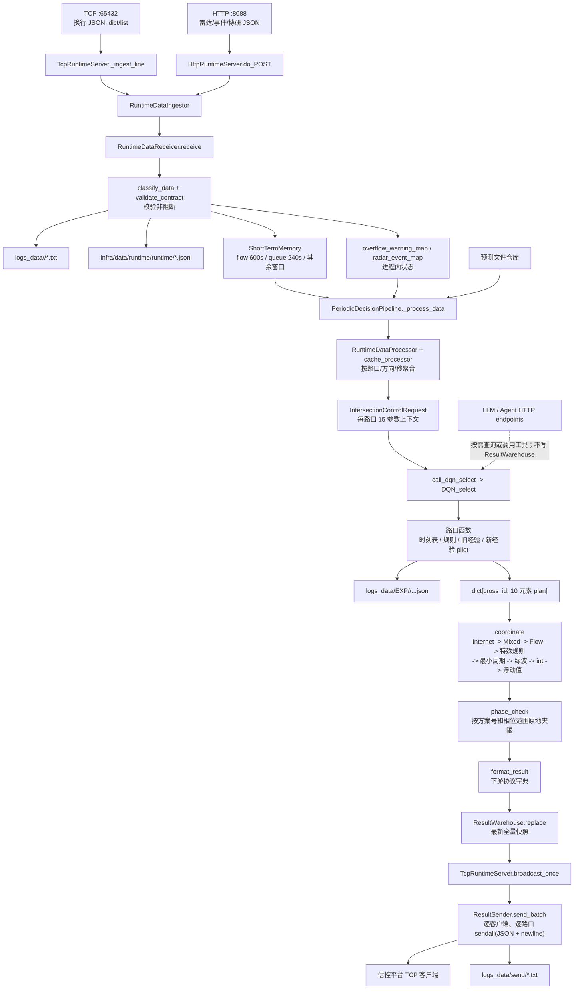

# AITC V2 重构前基线审计

> 审计日期：2026-10-01  
> 审计对象：当前仓库静态代码与现有测试；不修改生产代码，不改变业务行为。  
> 结论口径：以 `python Server_AITC.py` 的真实装配和调用关系为准，不以目录名、类名或设计文档中的目标架构为准。

## 1. 执行摘要

当前生产主链路是：

```text
Server_AITC.py::main
  -> runtime.application::create_application
  -> AITCApplication.run/start
  -> TCP/HTTP 接入数据
  -> ShortTermMemory 窗口
  -> PeriodicDecisionPipeline.run_once（默认每 50 秒）
  -> RuntimeDataProcessor / cache_processor 聚合
  -> 每路口 call_dqn_select -> lib.DQN_Select.DQN_select
  -> lib.Global_intersection_coordinate.coordinate
  -> phase_check.phase_check
  -> runtime.result_formatter.format_result
  -> ResultWarehouse.replace
  -> TcpRuntimeServer.broadcast_once
  -> ResultSender.send_batch（换行分隔 JSON）
```

关键结论：

1. 实时最终方案不是由 LLM 生成。LLM/Agent 是 HTTP 按需旁路，没有接入 `PeriodicDecisionPipeline`、`ResultWarehouse` 或 TCP 广播决策闭环。
2. 没有 LLM 服务时，默认 `llm_required=false`，启动检查只告警，实时控制链仍能独立计算和下发方案。
3. 名为 `DQN_select` 的生产入口目前不是神经网络 DQN 推理。实时链路不加载 `torch`、DQN 权重或 `time_schedule/Agent/DQN.py`；它是历史保留的路口分发器，内部混合时刻表、规则启发式、旧经验表和新经验分配器。
4. 真正的内部方案契约是十元素列表：`[phase0..phase7, reserved, program/state]`。全局协调和安全夹限会继续修改该列表；随后才打包为下游 TCP 协议。
5. 当前默认 `AITC_FLOW_ALLOCATOR_PILOT_MODE=new`，33 个白名单路口会尝试用 `lib/experience_pool/new_wwx.json` 计算新经验方案，失败再回退旧方案。因此经验池已经能间接影响最终配时，并非纯离线旁路。
6. Baseline Controller 的核心边界是 `RuntimeDataProcessor/cache_processor -> DQN_Select/经验与时刻表 -> coordinate/绿波/特殊规则 -> phase_check -> format_result`。这些模块中的顺序、列表索引、阈值、随机扰动、回退行为和原地修改语义都不应在 V2 第一阶段改变。

## 2. 实际运行入口与目录定位

| 区域 | 当前真实职责 | 是否在生产主链路 | 结论 |
|---|---|---:|---|
| `Server_AITC.py` | 日志、SIGINT、调用 `create_application()`、进入服务循环 | 是 | 唯一明确的服务启动脚本 |
| `runtime/application.py` | 全量依赖装配、线程/服务生命周期 | 是 | composition root；决定哪些实现真正生效 |
| `runtime/decision_pipeline.py` | 50 秒周期内的数据聚合、并发单路口计算、全局协调、校验、打包、入仓 | 是 | 实时控制主编排 |
| `runtime/tcp_server.py` | TCP 收数、连接管理、结果广播 | 是 | 同一连接既是数据源也是结果订阅者 |
| `runtime/http_server.py` | HTTP 雷达/博研收数、配置、健康、Agent/绿波管理接口 | 部分 | HTTP 感知数据进入主链；Agent 响应不进入主链 |
| `runtime/prediction_*` | 预测文件读写、每日任务 | 辅助 | 预测被传入选择器，但当前路口函数不消费预测参数 |
| `infra/data/` | 分类、非阻断校验、日志与 JSONL、窗口缓存、聚合适配、结果仓库与发送 | 是 | 数据底座，不决定控制策略，但数据形态是 Baseline 契约 |
| `lib/DQN_Select.py` | 历史单路口总分发器和 63 个路口函数 | 是 | 名称为 DQN，实质为规则/经验/时刻表混合控制 |
| `lib/Global_intersection_coordinate.py` | Internet/Mixed/Flow 三类全局处理、特殊路口、绿波、最终数值处理 | 是 | 单点结果到全局最终 action 的核心 |
| `lib/control_functions/global_processors/` | 从全局协调中拆出的已接线规则函数 | 是 | 仍由 `coordinate()` 直接调用 |
| `phase_check.py` | 根据 `intersection_result_config.json` 对相位时长原地夹限 | 是 | 最后一道实际方案约束 |
| `agent/` | HTTP Agent Harness、LLM 工具选择、查询及演示控制流程 | 否（与主链并列） | 不拥有最终方案仓库，不会自动下发 |
| `app/core/tools/signal_timing.py` | Agent 可按需直调同一个历史选择器 | HTTP 旁路 | 生成的结果只作为 HTTP 响应返回 |
| `app/core/control/` | V2 风格控制骨架 | 基本否 | 只有 `synergy/green_wave_service.py` 被装配用于配置/查询；scheduler、plan_generator、safety、output 等骨架未接主链 |
| `infra/model/qwen/` | 独立本地模型启动脚本 | 否 | 不被 Server 导入；生产服务通过 OpenAI-compatible HTTP 客户端访问 LLM |
| `time_schedule/Agent/DQN.py`、`DTQN.py` | 神经网络模型定义/训练相关代码 | 否 | 当前实时链没有导入关系 |
| `time_schedule/` | 时刻表 JSON 及维护脚本 | 是（数据文件）/否（多数维护脚本） | `Get_time_map()` 在运行期直接读 JSON；维护脚本不在服务生命周期内 |

### 2.1 生命周期与并发

`AITCApplication.start()` 实际启动：

- 可选 Nacos 同步（默认关闭）；
- HTTP 服务线程；
- 周期决策线程；
- TCP 结果广播线程；
- 每日预测调度器（默认开启）；
- 经验池调度器（默认开启）。

`AITCApplication.run()` 随后在主线程运行 TCP `serve_forever()`。周期决策对 186 个 `Lambdas.intersection_list` 路口使用 30 线程的 `ThreadPoolExecutor`。

### 2.2 其他可执行入口（不是生产主服务入口）

- `agent/mcp_server.py::main`：独立 stdio MCP server。它重新构造一套空的短期缓存和结果仓库，暴露查询/单路口控制工具；不连接正在运行的 `AITCApplication` 内存，也不负责周期决策或 TCP 下发。
- `infra/model/qwen/main.py::main`：本地 Qwen 模型 smoke test，不被 `Server_AITC.py` 导入。
- `Flow_predict.py`、`Queue_predict.py`：可独立执行预测任务；生产中通过 `runtime/prediction_service.py` 适配后由调度器调用。
- `time_schedule.py`、`time_schedule/*.py`：时刻表生成、检查和发布脚本；生产实时链只直接读取生成后的 JSON。
- `lib/data_ANS/*.py` 的多个 `main`：经验数据训练、清洗、比较、维护 CLI；生产生命周期只自动启动 `ExperiencePoolScheduler`。
- `test/client_tcp.py`、`test/client_http.py`：回放/测试客户端，不是服务入口。

因此“存在 `__main__`”不等于“参与最终配时主链”。V2 迁移时应保留这些运维入口，但不能把它们与 `Server_AITC.py` 的在线控制生命周期合并计算。

## 3. 当前真实数据流图



注意：图中的 LLM 虚线只表示 Agent 接口可按请求调用同一单路口工具；它不会把返回值汇入周期主链，也不会替换 TCP 最终方案。

## 4. 输入数据结构与数据处理

### 4.1 协议入口

TCP 使用换行分帧，一个 JSON 对象或对象数组为一批输入。HTTP 除已知管理/Agent 路由外，任意 POST 路径都会作为雷达/博研上报入口。分类规则是字段判别，不看显式 `type`：

| 类型 | 来源 | 识别标记 / 最小主要字段 | 进入控制窗口后的形态 |
|---|---|---|---|
| flow | TCP | `ycsb_xsfx`, `jtll_ddbh`, `ycsb_cdbh`, `ts` | 原始 dict；聚合为 LRUD 四方向总量和每秒 `pass/count` |
| queue | TCP | `car_nums`, `jtll_ddbh`, `start_time`；`car_nums[]` 含 `ycsb_cdbh/queue/all` | 每路口每方向 7 车道最大排队及每秒明细 |
| stage | TCP | `CrossId`, `time`, `curStageNo`, `curStageLen` | 每路口按秒的当前阶段号/时长 |
| extend | TCP | `curStageRemainLen`, `CrossId` | `(接收时间, dict)`，再按路口/接收秒聚合为记录列表 |
| online | TCP | `rid` | 路段 ID -> 接收时间 -> 记录列表；用于 Internet 状态和绿波 |
| latest | TCP | `inter_id` | 被缓存和落盘，但当前决策管线未消费 |
| overflow warning | TCP | `distance + jtll_ddbh + ts` | 不入普通窗口；更新 `overflow_warning_map[cross][direction]` |
| radar | HTTP | `deviceNo` 且无 `eventType` | 按设备映射到路口/方向的接收时间记录 |
| radar event | HTTP | `deviceNo + eventType` | 更新 `radar_event_map[eventType][deviceNo]` |
| boyan | HTTP | `deviceId` | 按设备映射到路口/方向的接收时间记录 |
| heartbeat/history | TCP/HTTP | `heartbeat` 或无已知标记 | 落盘；不进入配时聚合 |

重要语义：

- 短期窗口的过期判断使用**服务接收时的 `time.time()`**，不是报文内的 `ts/time/start_time`。
- flow/queue/stage 聚合时又使用报文时间构建秒级 key；extend/online/radar/boyan 使用缓存接收时间。
- `validate_contract()` 只记录质量问题，不拒绝数据；随后旧聚合函数仍可能因字段缺失而跳过、记录错误或返回部分结果。
- 每条已分类输入默认同时写兼容日志和长期 JSONL；这是接入路径的文件副作用。

### 4.2 路口状态构建

`PeriodicDecisionPipeline._process_data()` 先清过期窗口，再构建：

```text
intersection_flow[cross]              = [L, R, U, D] 的 600 秒计数
intersection_flow_duration2[cross]    = [L, R, U, D] 的最近 150 秒计数（默认）
result_queue_length[cross][direction] = 7 车道最大 queue
flow_map[cross][second]               = {pass: {L/R/U/D: [7 lanes]}, count: {...}}
queue_map[cross][second]              = {queue: ..., all: ...}
stage_map[cross][second]              = {curStageNo, curStageLen}
extend_map[cross][receive_second]     = [raw extend records]
online_map[rid][receive_second]       = [raw online records]
overflow_map[cross]                   = 合并雷达 OverFlow 事件与 TCP 溢出告警
radar_map[cross][receive_second]      = [raw radar records]
boyan_map[cross][direction][second]   = [raw boyan records]
```

没有 flow/queue/可选数据时，代码使用 `Lambdas` 中的全零/空字典深拷贝继续计算，而不是停止本轮。

### 4.3 统一单路口请求

每个路口被包装为 `IntersectionControlRequest`：

```python
IntersectionControlRequest(
    cross_id, current_time,
    traffic_vector, queue_vector, traffic_vector_duration2,
    flow_map, queue_map, stage_map,
    previous_coordinate,
    predicted_flow, predicted_queue,
    extend_map, overflow_map, radar_map, boyan_map,
)
```

`call_dqn_select()` 是唯一把该对象展开为历史 15 个位置参数的地方。

## 5. 当前真实调用链

### 5.1 启动、接入与周期触发

```text
Server_AITC.main
  -> setup_logging
  -> create_application
  -> AITCApplication.run
     -> start
        -> _check_llm_ready（失败默认只告警）
        -> HttpRuntimeServer.start
        -> thread: AITCApplication._run_decision_loop
        -> TcpRuntimeServer.start_broadcast_thread
        -> PredictionScheduler.start
        -> ExperiencePoolScheduler.start
     -> TcpRuntimeServer.serve_forever

TCP: handle_client -> _ingest_line -> RuntimeDataIngestor.ingest_tcp
HTTP: do_POST fallback -> RuntimeDataIngestor.ingest_http
二者 -> RuntimeDataReceiver.receive
     -> classify_data / validate_contract
     -> RuntimeDataWriter.write + LongTermMemory.store_runtime_data
     -> ShortTermMemory.add 或事件状态更新
```

### 5.2 单轮决策

```text
AITCApplication._run_decision_loop
  -> PeriodicDecisionPipeline.run_once
     -> _process_data
        -> RuntimeDataProcessor.snapshot
        -> _build_flow_data / _build_queue_data / _build_optional_data
        -> RuntimeDataProcessor.{flow,flow_duration,queue,stage,extend,online,radar,radar_event,boyan}
        -> ThreadPoolExecutor: _process_single_intersection × 186
           -> call_dqn_select(IntersectionControlRequest)
              -> DQN_select(15 legacy arguments)
                 -> DQN_select_<cross_id> 或全零
                    -> Get_time_map / 规则函数 / chuli_shuju
                    -> select_pilot_schedule -> allocate_from_runtime_data（部分路口）
           -> write_experience
     -> coordinate（当前 `current_result` 保持 186 key 时调用）
        -> update_internet_road_state
        -> process_internet_intersection
        -> process_mixed_intersection
        -> process_flow_intersection
        -> apply_special_intersection_adjustments
        -> complete_minimum_cycle
        -> load_enabled_green_wave_corridors / apply_green_wave_coordination
        -> finalize_plan_values -> apply_floating_value
     -> phase_check
     -> write_phase_check
     -> format_result × 路口
     -> ResultWarehouse.replace
```

### 5.3 输出

```text
TcpRuntimeServer.broadcast_forever（默认每 50 秒）
  -> broadcast_once
  -> ResultWarehouse.snapshot
  -> ResultSender.send_batch
     -> socket.sendall(json.dumps(result) + "\n")
     -> RuntimeDataWriter.write_send_result
```

广播周期和决策周期是两个独立线程；因此一次广播取的是当时仓库中的最新完整快照，不保证与某个决策周期严格一一对应。

## 6. “DQN / 经验 / 时刻表 / 其他控制”的真实位置

### 6.1 `DQN_select` 实际是什么

`lib/DQN_Select.py::DQN_select` 做两层事情：

1. 对 `Cross_Video` 中的 65 个 ID 先读取当前工作日/周末当前小时的时刻表；不在集合中的 121 个 ID 初始为 `[0] * 10`。
2. 对其中 63 个有专用函数的 ID 继续分发，专用函数按路口采用规则、时刻表、旧经验表或新经验分配器。`1300592`、`1300644` 在集合内但没有专用分支，仓库中也没有对应时刻表文件，当前初始结果为全零。

63 个专用函数的静态调用形态如下（一个函数可包含多种来源）：

| 形态 | 函数数 | 含义 |
|---|---:|---|
| `chuli_shuju + select_pilot_schedule` | 24 | 先算旧经验方案，再按 pilot 模式选择新方案或旧方案 |
| `chuli_shuju` | 11 | 读取 `lib/wwx.json` 的旧经验容量表 |
| `select_pilot_schedule` | 9 | 以函数内 legacy 向量为回退，尝试新经验分配器 |
| `Get_time_map` | 7 | 当前小时固定时刻表及路口规则 |
| `Get_time_map + chuli_shuju` | 7 | 先取时刻表/规则，后由旧经验方案覆盖或参与 |
| `chuli_shuju3` | 3 | 不依赖 extend 的旧经验计算 |
| `Get_time_map + chuli_shuju + select_pilot_schedule` | 2 | 三层混合 |

这里没有在线 Q-learning、神经网络前向推理、模型权重加载或 reward 最大化选择。`lib/AITC_tool.py::generate_rl_report()` 虽然用“强化学习”措辞生成随机候选报告，但全仓库没有调用它，不属于运行链。

### 6.2 经验方案

旧经验路径：

```text
DQN_select_<id>
  -> lib.cha1.chuli_shuju / chuli_shuju3
  -> lib/wwx.json + lib/cross_info.json
  -> 依据 10 分钟车道流量、实际阶段集合查表
  -> 10 元素方案
```

新经验 pilot 路径：

```text
DQN_select_<id>
  -> select_pilot_schedule
     -> record_shadow_comparison
     -> allocate_from_runtime_data
     -> lib/experience_pool/new_wwx.json + lib/cross_info.json
     -> 合格则 selected_schedule_source=new，否则 legacy
     -> logs_data/shadow/*.jsonl 审计记录
```

默认 pilot mode 是 `new`，默认目标集合 33 个路口；`legacy` 不运行新模块，`shadow` 只比较不采用，`new` 在有效性检查通过时采用新方案。经验池调度器默认每天维护并可能原子激活 `new_wwx.json`，所以它是“异步学习数据维护 -> 下一轮运行读取”的间接闭环。

### 6.3 时刻表与全局其他控制

- `Get_time_map()` 根据 `chinese_calendar.is_workday(date.today())` 选择工作日/周末 JSON，再按本地小时取十元素方案。
- `coordinate()` 会覆盖或二次加工单路口结果：纯 Internet 路口从 `road_info.json + FIne_turn` 生成；Mixed/Flow 路口根据现有 plan、互联网状态、强制道路状态重新选状态并生成相位。
- 随后还有特殊路口硬编码、最小 60 秒周期补足、启用走廊绿波、整数化、浮动值。
- `phase_check()` 最后根据 `intersection_result_config.json` 中 `cross -> plan_id -> phase range` 夹限；路口或 plan 缺配置时只报告，不拒绝、不替换。

路口集合的当前静态事实：`intersection_list` 共 186 个；`intern_road_id` 133 个、`video_road` 3 个、`video_flow_road` 52 个、`aibi_road` 1 个，集合有重叠。三类与 AIBI 并集之外有 `1300782`、`2719089` 两个 ID，其中 `2719089` 在特殊规则中复制 `1300068` 方案，`1300782` 仅被取别名但未见有效赋值。以上四个特殊 ID（再加 `1300592/1300644`）也都不在 `intersection_result_config.json` 中，最终校验会标为 missing config 而不修正。

### 6.4 预测的实际作用

流量/排队预测服务会：

- 在有合法毫秒时间戳时写本轮预测样本日志；
- 每日 03:00（默认）运行预测任务；
- 每轮读取当前预测并填入 `IntersectionControlRequest`。

但 `cur_flow_pre_map` / `cur_queue_pre_map` 在 63 个 `DQN_select_<id>` 中只出现在函数签名，没有函数体读取；所以当前预测结果**不改变最终配时**。重构时应先用特征测试固化这一事实，不要因为参数存在就宣称预测已参与决策。

## 7. 最终配时与输出数据结构

### 7.1 内部最终 plan

全局协调和 `phase_check` 之间的实际结构：

```python
{
    "1300068": [p0, p1, p2, p3, p4, p5, p6, p7, reserved, program_id],
    # ... 186 个路口
}
```

- 索引 `0..7`：相位绿灯时长，最终会转为 `int`；
- 索引 `8`：历史保留位，通常为 0；
- 索引 `9`：方案/状态号，同时成为下游 `programID`；
- 各路口函数还返回 `coordinate_map`、8 项 `model_info_list`、30 项 `EXP_list`，它们不是 plan 本体。

该列表的索引含义是事实上的 ABI。不同 `road_info[cross][state]["phase"]` 决定相位索引对应的交通方向，不能仅按统一的“东西/南北”猜测。

### 7.2 下游报文

`format_result()` 对每个路口输出：

```json
{
  "additional": {
    "tlLogic": {
      "id": "1300068",
      "type": "NoType",
      "programID": 0,
      "phase": [{"duration": 42}, {"duration": 18}]
    }
  },
  "traffic_vector": [{"id": 1, "flow": 12}],
  "modelInfo": {
    "crossID": "1300068",
    "acc": 95,
    "r": 0,
    "rt": 10,
    "score": 91,
    "pdf": 12,
    "pdq": 3,
    "pds": 3,
    "pd": 18
  }
}
```

具体规则：

- `programID = plan[9]`；
- `build_phase()` 从 `plan[0]` 开始遇到第一个 `0` 即停止，后续非零值也不会输出；
- `traffic_vector` 把 LRUD 四元素按 `location_to_intersection_lambda` 反查回道路检测器 ID；一方向存在多个检测器时，字典反转只保留其中一个；
- 模型信息为空时使用缺省值，其中 `score` 为 85–100 的随机整数；
- 每个路口独立作为一行 JSON 广播，不是一次发送一个包含 186 路口的数组。

## 8. LLM 与 Agent 的真实边界

### 8.1 是否参与最终配时

不参与周期最终配时。证据链：

- `PeriodicDecisionPipeline` 没有 LLM/Agent 依赖；
- `create_application()` 将 `agent_harness` 只注入 `HttpRuntimeServer`；
- Agent 返回值由 HTTP handler 直接响应，没有调用 `ResultWarehouse.replace()` 或 `ResultSender`；
- `ControlProcessAgent` 的十步流程包含模拟默认交通状态和独立结构，仅用于 HTTP 演示/分析，不是主控方案 ABI。

Agent 有三种与控制相关的旁路能力：

1. `/api/signal-timing`：不经 LLM，按需调用 `SingleIntersectionSignalTimingTool`；
2. `/api/agent/signal-timing`、`/api/agent/tools`、`/api/agent/query`：LLM 选择注册工具并返回结果；
3. `/api/agent/control-process`：规则步骤生成结果，LLM 主要生成逐步说明。

这些接口的“方案”不会自动成为 TCP 下发方案。

### 8.2 无 LLM 是否可独立运行

可以，前提是使用默认 `AITC_LLM_REQUIRED=false`：

- 应用仍创建 LLM client；
- `start()` 调用 `list_models()` 健康检查；
- 不可达时记录 warning 后继续启动 TCP、HTTP、周期决策和广播；
- 只有实际调用依赖 LLM 的 HTTP Agent 路由时会失败/降级。

若显式配置 `AITC_LLM_REQUIRED=true`，LLM 不可达会使应用启动失败；这是部署开关，不是控制算法依赖。

## 9. 核心函数审计表

表中“业务逻辑”指会改变配时、选择控制路径或定义业务数据语义；“副作用”列出可观察的外部/共享状态变化。

| 文件 / 函数 | 输入 | 输出 | 直接调用谁 | 谁调用它 | 业务逻辑 | 副作用 |
|---|---|---|---|---|---:|---|
| `Server_AITC.py::main` | 进程环境、SIGINT | 无；阻塞运行服务 | `setup_logging`, `create_application`, `application.run/stop` | `__main__` | 否 | 日志 handler、信号处理、启动网络服务 |
| `runtime/application.py::create_application` | `RuntimeSettings` | `AITCApplication` | 构造全部 data/runtime/agent/算法依赖 | `Server_AITC.main`、测试 | 装配选择 | 构造输出 store 时可创建目录 |
| `AITCApplication.start/run/_run_decision_loop` | 已装配组件、周期 | 持续运行 | LLM 健康检查、HTTP/TCP/调度器、`run_once` | `main` | 调度语义 | 线程、网络监听、调度任务 |
| `TcpRuntimeServer._ingest_line/handle_client` | TCP 字节流/一行 JSON | 分类结果被忽略 | `json.loads`, `ingestor.ingest_tcp` | TCP 连接线程 | 协议语义 | socket、客户端全局列表 |
| `HttpRuntimeServer.do_POST` fallback | HTTP JSON | HTTP status JSON | `ingestor.ingest_http` | HTTP server | 路由语义 | 网络响应、数据接入 |
| `RuntimeDataIngestor._ingest_payload` | dict 或 list、source | `list[ClassifiedData]` | `receiver.receive` | TCP/HTTP 入口 | 否 | 间接落盘/缓存 |
| `RuntimeDataReceiver.receive` | 单条 Mapping、source | `ClassifiedData` | `classify_data`, `validate_contract`, writer/repository/cache | ingestor | 数据分类/过滤 | 文件、JSONL、缓存、事件共享 map、质量计数 |
| `classify_data` | dict、来源 | `ClassifiedData` | 无 | receiver | 数据契约语义 | 无 |
| `ShortTermMemory.add/recent_data/duration_data` | 类型、数据、接收时间 | 窗口快照 | 过期清理 | receiver/processor | 时间窗口语义 | 进程内共享 deque |
| `RuntimeDataProcessor.*` | 短期缓存 | 算法兼容 maps/vectors | `cache_processor.process_*` | pipeline、Agent 控制工具 | 适配边界 | 无直接外部副作用 |
| `cache_processor.process_flow_data` | flow 列表、Lambdas | 四方向计数、秒级 flow map | Lambdas 映射 | `RuntimeDataProcessor.flow*` | 是（特征构建） | 日志 |
| `process_queue_data/stage/extend/online/radar/boyan/radar_event_data` | 各类窗口/事件 map | 对应路口状态 map | 映射与聚合 helpers | `RuntimeDataProcessor` | 是（特征构建） | 日志；无文件写 |
| `PeriodicDecisionPipeline.run_once` | 当前缓存和依赖 | 下游报文列表 | `_process_data`, `coordinate`, `phase_check`, `format_result`, warehouse | 决策线程、测试 | 是（顺序即行为） | phase report、结果仓库、可选快照 |
| `_process_data` | 全部窗口 | `result_map, online, overflow, extend` | 构建各输入、预测读取、并发 186 个 `_process_single_intersection` | `run_once` | 是（默认/并发边界） | 预测日志、日志、更新 `last_coordinate_set` |
| `_process_single_intersection` | 单路口切片 | `(id, result, coordinate_map)` | `call_dqn_select`, `write_experience` | `_process_data` 线程池 | 是 | 每路口 EXP 文件、日志 |
| `lib/control_functions/dqn_control.py::call_dqn_select` | `IntersectionControlRequest` | 4 元组 | `DQN_select` | pipeline、Agent 工具 | 否（参数适配） | 继承底层副作用 |
| `lib/DQN_Select.py::DQN_select` | 历史 15 参数 | `(plan, coordinate, model_info, exp)` | `Get_time_map`, `DQN_select_<id>` | `call_dqn_select` | 是（路口分发） | 读时刻表、stdout；底层可能写 shadow 日志 |
| `DQN_select_<id>`（63 个函数族） | 本路口流量/排队/阶段/事件等 | 同上 | AITC_tool、`chuli_shuju*`、pilot、路口公式 | `DQN_select` | 是 | 读 JSON、随机 model score、大量 stdout、shadow 文件 |
| `AITC_tool.Get_time_map` | cross ID、系统日期 | 24 小时时刻表或 `None` | `is_workday`, `json.load` | selector/global fallback | 是 | 文件读取、失败 stdout |
| `cha1.chuli_shuju/chuli_shuju3` | flow/extend、本路口 ID | 十元素旧经验方案 | `lib/wwx.json`, `cross_info.json` | 多个路口函数 | 是 | 文件读取、stdout |
| `flow_allocator_shadow.select_pilot_schedule` | legacy plan、flow/extend、ID | legacy/new 十元素方案 | `record_shadow_comparison` | 35 个已接线路口函数；默认目标 33 个 | 是（开关/回退） | 读环境和 JSON、写 shadow JSONL |
| `flow_time_allocator.allocate_from_runtime_data` | flow/extend、经验表、cross config | 方案及审计详情 | 周期选择、车道聚合、容量查表 | shadow/pilot | 是 | 无直接写；调用者缓存/记录 |
| `Global_intersection_coordinate.coordinate` | 全路口 plan、coordinate、online、overflow、extend | 原地修改后的 plan map | 三类 processor、special、minimum cycle、green wave、floating | pipeline | 是（核心全局控制） | 读多份 JSON、修改全局 `inter_road_state`/绿波状态、随机数、stdout |
| `update_internet_road_state` | online map、路口集合 | 同一个共享 state | 无 | `coordinate` | 是 | 修改模块级 `inter_road_state` |
| `process_internet_intersection` | Internet 状态、Fine、road config | plan/report | demand/state/phase helpers | `coordinate` | 是 | 原地修改 `road_info` 内的 `min_pass_time` 列表别名 |
| `process_mixed_intersection` | 当前 plan、Internet 状态、road config | plan/report | mixed demand/state/phase helpers、时刻表 fallback | `coordinate` | 是 | 原地修改 plan |
| `process_flow_intersection` | 当前 plan、road config | plan/report | flow state/phase helpers、时刻表 fallback | `coordinate` | 是 | 先清零再生成；异常保留已清零 plan |
| `apply_special_intersection_adjustments` | 全路口 plan 与多类状态 | 同一 plan map | 多个硬编码公式、`Get_time_map` | `coordinate` | 是 | 原地修改、随机数、时间、stdout |
| `complete_minimum_cycle` | plan map | 同一 map | 无 | `coordinate` | 是 | 原地修改，补足前五相位合计 60 秒 |
| `lvbotest.apply_green_wave_coordination`（经 `coordinate`） | corridor、plan、coordinate、extend、时间 | plan map | 绿波状态/周期/偏移算法 | `coordinate` | 是 | 模块级跨轮状态 |
| `finalize_plan_values` | plan map | `(map, report)` | `apply_floating_value` | `coordinate` | 是 | 原地整数化；读取浮动配置 |
| `phase_check.phase_check` | plan map | `(同一 map, report)` | 配置快照 | pipeline | 是（最终范围约束） | 原地修改 plan；模块配置可被 HTTP 更新 |
| `runtime.result_formatter.format_result` | ID、plan、traffic、model info | 下游协议 dict | `build_phase/vector/model_info`, `DecisionResult` | pipeline | 输出契约 | 缺省 model score 使用随机数 |
| `ResultWarehouse.replace/snapshot` | 报文序列 | 无 / 深拷贝列表 | `DecisionResult` | pipeline / TCP 广播 | 否 | 替换进程内最终结果快照 |
| `TcpRuntimeServer.broadcast_once` | clients、warehouse | 无 | `ResultSender.send_batch` | 广播线程 | 否 | 网络、移除断连客户端 |
| `ResultSender.send_batch` | sockets、结果列表 | 断开 socket 列表 | `sendall`, writer | broadcast | 否 | 网络、send 日志文件 |

## 10. Baseline Controller 边界

### 10.1 必须视为已验证控制基线的部分

以下整体形成“输入状态 -> 最终 TCP 方案”的 Baseline Controller：

```text
Lambdas.py 映射与零值模板
infra/data/cache_processor.py 的聚合语义
runtime/decision_pipeline.py 的调用顺序和降级默认
lib/control_functions/types.py 的 IntersectionControlRequest
lib/control_functions/dqn_control.py::call_dqn_select
lib/DQN_Select.py + lib/AITC_tool.py + lib/cha.py + lib/cha1.py
lib/data_ANS/flow_allocator_shadow.py + flow_time_allocator.py
time_schedule/schedule_json/*
lib/wwx.json / lib/experience_pool/new_wwx.json / lib/cross_info.json
lib/Global_intersection_coordinate.py
lib/control_functions/global_processors/*
lib/road_state.py / lib/floating_value.py / lib/lvbotest.py / lib/green_wave_functions.py
lib/road_info.json / lib/green_wave_corridors.json / 浮动值和道路状态配置
phase_check.py + intersection_result_config.json
runtime/result_formatter.py
```

这里的“已验证”表示当前生产行为的基线，并不表示每段代码都正确、整洁或算法先进。发现疑似 bug 时应先加固定输入的快照/回放测试，再单独审批修复；不能在结构重构中顺手改掉。

### 10.2 不属于实时 Baseline Controller 的部分

- `agent/`、`app/infrastructure/llm/`、`infra/model/qwen/`；
- `app/core/control/dispatch`、`single_point`、`safety_engine`、`output` 等未装配骨架；
- `app/core/tools/control_flow.py` 的十步权重演示控制；
- `time_schedule/Agent/DQN.py`、`DTQN.py` 和 `time_schedule/updata_road.py` 的 torch 模型；
- `lib/AITC_tool.generate_rl_report()`；
- `lib/control_functions/registry.py`、`global_control.py`、`schedule_control.py` 的未来 function-calling 门面（主链未调用）；
- HTTP Agent 返回的临时单路口方案。

预测服务和经验池调度属于辅助边界：预测当前不影响 plan；经验池调度会更新被 pilot 读取的数据文件，因此可能影响后续 plan。

## 11. 后续重构中禁止改变的行为

除非另立需求、回放对比通过并明确批准，不得改变：

1. TCP 以 `\n` 分帧，连接同时收数和接收全量结果广播的协议行为。
2. 字段优先级分类、未知数据落 history、契约校验非阻断的行为。
3. 各数据类型窗口长度，以及“按接收时间过期、按报文时间聚合”的混合时间语义。
4. `Lambdas` 的路口/检测器/方向/车道映射和 LRUD 顺序。
5. `IntersectionControlRequest -> DQN_select` 15 参数顺序。
6. 十元素 plan 的索引 ABI、零值结束标记和 `plan[9] -> programID`。
7. 路口白名单、63 个分支、时刻表工作日判断、经验表路径、pilot 默认 `new`、所有失败回退。
8. 全局处理严格顺序：Internet -> Mixed -> Flow -> special -> minimum cycle -> green wave -> int/floating -> phase_check。
9. 多个集合重叠时同一路口可能被连续处理的现有行为。
10. `process_flow_intersection` 异常时保留已清零 plan、部分高峰 override 使用 tuple 导致回退/失败等历史兼容行为。
11. `phase_check` 只夹限、不拒绝；缺路口/缺 plan 配置时原方案继续输出；遇首个 0 停止后续相位校验。
12. `build_phase` 遇第一个 0 截断、每路口单独发 JSON、结果仓库整批替换。
13. `get_model_map` 和缺省 model info 中当前存在的随机 score（即使它不理想，也属于可观察输出）。
14. `coordinate`、特殊规则、绿波和经验模块的原地修改及跨轮状态，直到有等价性测试证明可改变。

## 12. 已发现的重复、死代码与职责混乱

### 12.1 明显未接主链或名实不符

- `app/core/control/` 大部分是未装配骨架；与真实 `runtime/decision_pipeline + lib` 并存，容易误判“新控制架构已生效”。
- `DQN_select`、`source="dqn"` 等命名会误导；当前实时执行的是规则/经验/时刻表混合分发，不是 torch DQN。
- `time_schedule/Agent/DQN.py`、`DTQN.py` 以及 `generate_rl_report()` 不在生产调用图中。
- `lib/control_functions/{registry,global_control,schedule_control}.py` 主要服务未来模型工具/测试，主链直接调用旧入口。
- `latest` 数据有分类、窗口和聚合函数 `process_latest_data()`，但 `PeriodicDecisionPipeline` 只取快照，不调用聚合、不送入控制器。
- 流量/排队预测完成装配和传参，但路口函数不读取预测值。

### 12.2 重复与过宽职责

- `lib/DQN_Select.py` 约 3,700 行，63 个高重复分支混合路由、数据处理、业务公式、时刻表与诊断输出。
- `Global_intersection_coordinate.coordinate()` 同时负责类别调度、状态聚合、特殊路口、绿波、最终数值处理和大量配置读取。
- `coordinate()` 在进入 `finalize_plan_values()` 前先对索引 0..7 做一遍 `int`，而 `finalize_plan_values()` 又对整个 plan 做 `int`，存在重复转换。
- `DQN_select` 每轮每路口直接读时刻表；`coordinate` 每轮也读 `road_info.json`、Fine、绿波配置、浮动值等，配置 I/O 与纯算法混在一起。
- 输入同时落 `logs_data` 和长期 JSONL；这是当前可追溯行为，但存储职责和容量策略分散。
- `model_info` 与 `EXP_list` 是列表位置协议，类型注解却有多处写成 dict；运行依赖位置而不是类型。

### 12.3 应先固化、不能顺手修复的明显风险

- `coordinate(include_green_wave=False)` 的参数没有控制实际分支：函数仍无条件执行绿波。因此 `coordinate_without_green_wave` 等门面名义上关闭绿波，实际上没有关闭。
- `PeriodicDecisionPipeline` 的 `result_map` 预先含 186 个 key，故 `len(current_result) == len(intersection_list)` 通常不能代表“所有路口成功”；单路口异常时还可能留下空 `result_action`，后续才失败。
- `1300592`、`1300644` 无专用选择器、无时刻表；`1300782` 没有有效生成分支；这些 ID 缺少 phase-check 配置。`2719089` 依赖特殊规则复制另一路口方案。
- `build_traffic_vector` 把 `(intersection, direction)` 反转成单个 detector ID；同方向多个 detector 时后者覆盖前者。
- radar sample 中 `createTime` 可为毫秒整数，而 `process_overflow_events()` 按 `%Y-%m-%d %H:%M:%S` 字符串解析；同时状态常写为字符串 `'0'/'1'`，个别路口规则比较整数 `1`。需要真实数据回放确认溢出规则是否按预期触发。
- `special_intersections.py` 含大量宽泛 `except`、随机调整、时间条件和硬编码 ID；任何“清理”都可能改变结果。
- `ResultSender` 对客户端逐个阻塞发送且未设置发送超时；慢客户端能拖延整轮广播，但这是输出可靠性问题，不应在算法重构中混改。

## 13. 建议的第一批最小重构点

以下顺序优先建立可证明的等价性，不新增大抽象层：

1. **建立黄金主链回放测试。** 固定系统时间、工作日判断、随机种子和配置文件，保存 `_process_data` 输入快照，对比 `coordinate` 前 plan、`coordinate` 后 plan、`phase_check` 后 plan、最终 TCP payload 四个检查点。先覆盖普通 Internet、Mixed、Flow、旧经验、新 pilot、绿波、特殊路口和全零路口各一例。
2. **生成只读的路口路由清单测试。** 自动断言 186 个 ID 在 `Cross_Video/intern/video/video_flow/aibi/special/phase config/schedule` 中的归属，显式标记允许的缺口，防止列表漂移而无人知晓。
3. **只抽取 `DQN_select` 的静态 dispatch 表。** 保留原函数、参数和调用顺序，只把 63 段 `elif` 映射为 `cross_id -> callable`，并用逐路口等价测试锁定结果；不要同时改公式或命名所有算法。
4. **把运行期配置读取收口为一轮只读快照。** 首先只减少同轮重复读文件，不改变文件格式、刷新频率（每轮）、别名/原地修改语义；对时刻表按路口读取尤其要谨慎。
5. **删除前先隔离未接线骨架。** 给 `app/core/control/` 未接线类加明确的 experimental 文档标识，或在后续独立变更中移到实验区；本轮不要让它们接管生产链。
6. **给真实边界补准确类型。** 仅为 `Plan10`、`ModelInfo8`、`Experience30` 和下游 payload 添加 type alias/校验测试，不在热路径新增自动归一化，不改变浮点到整数的时点。
7. **将已知风险拆成独立修复单。** `include_green_wave` 无效、overflow 类型不一致、缺失路口方案/校验、预测未消费、慢客户端等分别评估，不能混入“架构整理”提交。

不建议第一批做：替换全部 `lib`、引入通用规则引擎、让 LLM 接管主控、统一重写所有路口函数、立即迁移数据库、同时修改方案结构。这些动作无法在缺少黄金回放的情况下证明行为不变。

## 14. 审计验证清单

本次审计使用以下只读检查：

- 从 `Server_AITC.main` 和 `create_application` 反向确认真实装配；
- 全仓库检索 `PeriodicDecisionPipeline`、`DQN_select`、`coordinate`、`phase_check`、`ResultWarehouse`、`send_batch` 的调用方；
- AST 统计 63 个 `DQN_select_<id>` 对时刻表/旧经验/pilot 的调用形态；
- 运行时只读导入并比较 `intersection_list` 与各控制集合：186 个唯一路口、65 个 selector 路口、133/3/52/1 个全局类别集合；
- 检查两个 torch DQN 模块与生产代码不存在导入关系；
- 检查预测参数只有传递、没有函数体消费；
- 检查 Agent 装配只进入 HTTP server，不进入周期管线或最终结果仓库；
- 检查最终十元素 plan 到 TCP payload 的转换和换行发送协议。

本文件是 V2 重构的行为基线说明，不是对现有所有算法正确性的背书。后续任何改变最终 plan 的修复，应在独立变更中附输入快照、前后输出差异和业务审批。
