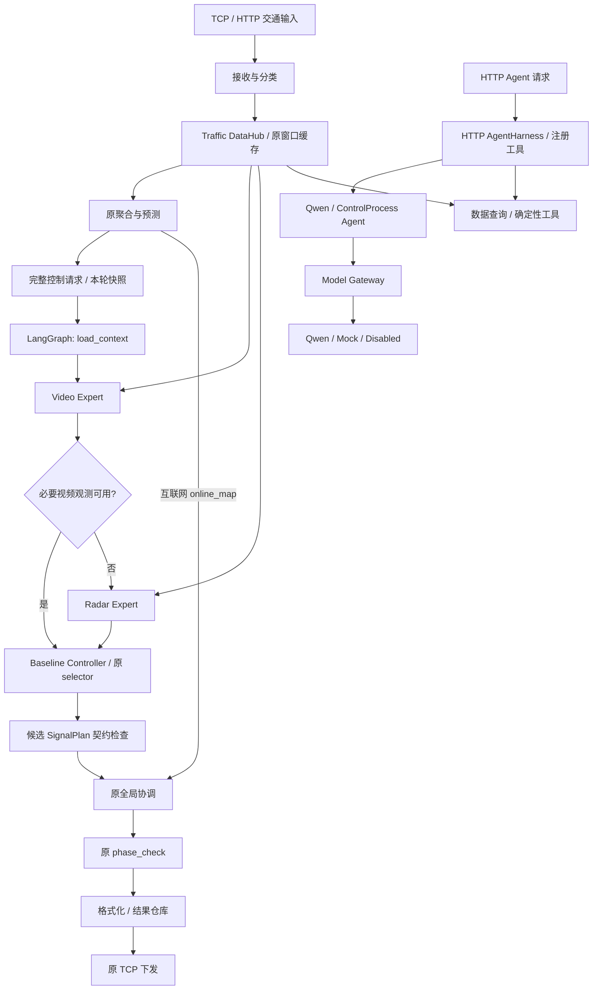

# AITC V2 当前架构总览

核对日期：2026-10-05。本文描述已实现的 Phase 0–6 代码与本轮经验回归修复。
核对时 `origin/main` 为 Phase 5 的 `d2f0efe`（PR #42）；Phase 6 在已推送的
`feature/v2-model-gateway` 分支，尚未创建 PR。本轮修复继续在该分支提交。
合并状态以 GitHub PR 为准，各阶段文档保留当时的验证记录。

## 现在是什么系统

目标中的数据中心、统一契约、领域专家、LangGraph 编排和原有控制策略已经接线。
Qwen 接入已通过统一 Gateway 收口，但目前服务于 HTTP Agent 请求与启动就绪检查；
周期配时图尚未接入 Qwen Planner/Reviewer。完整目标架构还需要 Phase 7–10。

当前基础控制链独立于模型调用。关闭 LLM 时仍按原算法产生配时；Qwen 不可达时默认
告警后继续启动，只有显式配置 `AITC_LLM_REQUIRED=true` 才要求模型就绪。



图中模型网关与周期控制图没有连线：当前代码没有这条调用关系。
Video/Radar 为图的路由提供证据，原策略继续接收完整控制请求，包含预测、
多源观测及上一轮协调状态；专家摘要不能替换这些业务输入。互联网 `online_map`
单独保留在后续全局协调输入中。

## 代码在哪里

| 职责 | 当前实现 | 状态 |
|---|---|---|
| 服务入口与装配 | `Server_AITC.py`、`runtime/application.py` | TCP、HTTP、周期决策与调度共用运行组件 |
| 严格核心契约 | `infra/data/traffic_schemas.py`、`traffic_adapters.py`；`app/core/control/schemas.py`、`adapters.py` | RawTrafficEvent、TrafficSnapshot、ExpertTrafficState、SignalPlan |
| 交通数据中心 | `infra/data/datahub.py` | 按路口隔离当前事件、来源查询、最近 N 轮严格快照与质量信息 |
| 短期与长期记忆 | `infra/data/memory/` | 内存窗口缓存与 JSON/JSONL 仓库；复用原数据底座 |
| 聚合与预测 | `infra/data/runtime_processor.py`、`runtime/prediction_service.py` | 保留原计算与副作用顺序 |
| 领域专家 | `agent/experts/` | Video/Radar 已实现；Internet/EV 保留明确 TODO |
| 周期 LangGraph | `agent/graph.py`、`agent/state.py` | 状态、条件路由、只读专家重试、执行上下文 |
| 原控制策略 | `app/core/control/policies/baseline.py` | 包装既有 selector/coordinator，保留原四元组接口 |
| 周期运行 | `runtime/decision_pipeline.py` | 全批次协调后调用原 phase_check，再格式化并替换结果 |
| 输出与广播 | `infra/data/result_warehouse.py`、`result_sender.py`、`writer.py` | 原 TCP 报文和本地日志 |
| HTTP Agent 执行 | `agent/harness.py`、`agent/qwen_agent.py`、`agent/control_agent.py` | 已有意图与注册工具接口；与周期控制图并列 |
| 统一模型接入 | `app/infrastructure/llm/` | Qwen、Mock、Disabled；同步与异步调用、严格请求/响应边界 |
| 配置 | `app/config.py` | 模型、DataHub、经验发布路径用 pydantic-settings；其余运行字段保留原配置机制 |

`DQN_Select.py` 的名称不能证明当前运行了在线神经网络 RL 推理。当前生产 selector
主要使用经验、时刻表和规则；V2 包装保留它实际执行的逻辑，没有另造学习算法。

生产路径还保留两项兼容行为：严格 snapshot 捕获失败时记录质量问题，原完整请求仍
可继续配时；单路口候选契约不合法时保留原结果供全局协调处理。它们应在后续安全门
阶段结合真实业务约束处理，不能把当前契约检查称为完整最终安全门。

## 与目标架构的差距

| 阶段 | 当前完成情况 | 后续需要完成的内容 |
|---|---|---|
| Phase 0–2 | 审计、核心契约、Baseline Controller 已完成 | 持续以回归样例守住原配时行为 |
| Phase 3–4 | DataHub、Video/Radar 专家已完成 | Internet/EV 按真实数据补齐，目前无伪造实现 |
| Phase 5–6 | 最小真实 LangGraph 与统一模型网关已完成 | 模型网关尚未作为周期控制的认知层使用 |
| Phase 7 | 待开始 | 严格工具动作、查询/调用策略、Planner/Reviewer 与异常解释 |
| Phase 8 | 待开始 | 独立确定性 Safety Gate：相位、时长上下界、静态配置与业务约束、可靠 fallback |
| Phase 9 | 待开始 | 每次决策关联输入、专家/工具、策略、候选/最终方案、fallback、耗时与错误 |
| Phase 10 | 已有逐阶段测试，最终验收待完成 | 完整闭环场景与集成验收；真实 Qwen 推理和现场运行尚未验证 |

当前 `phase_check.py` 是原有确定性检查：缺静态配置时仅报告，遇到第一个零值会
停止后续时间检查。因此还不能宣称已满足 Phase 8 的完整安全要求。已有日志和历史
存储也不能替代 Phase 9 的完整决策 trace。

仓库中较早建立的 `app/core/control/safety_engine.py`、`output/dispatcher.py`
等仍有骨架实现，也没有替换周期控制的实际校验/发送链。看到安全引擎目录不代表
完整 Safety Gate 已落地；当前真实运行以本文接线和对应代码为准。

最终目标是：快速正常场景由原策略执行；复杂场景由受约束 Qwen 选择专家/工具、
审查算法候选方案；所有最终方案都通过独立确定性 Safety Gate 再发送。Qwen 不自由
生成最终绿灯时间，模型故障也不阻断基础控制链。

## 经验模块的 2 failures / 1 error

这些是 Phase 0 开始就已复现的独立经验套件问题，不是本轮 V2 新增的控制失败。
2026-10-05 修复前仍为 111 项测试、2 failures、1 error。

| 测试 | 原因 | 本轮修复 |
|---|---|---|
| `test_non_target_road_does_not_create_a_log` | 把已进入默认试点白名单的 `1300086` 当作非目标；实际会尝试分配并记录 fixture 缺配置错误 | 使用明确不在白名单的 `9999999`，隔离环境配置；目标测试覆盖全部 33 个默认道路 |
| `test_non_pilot_selector_always_returns_legacy` | 同样误把 `1300086` 当作非试点，错误期待影子分配不被调用 | 用真实非试点道路验证 legacy/shadow/new 三种模式都保留原方案 |
| `test_send_experience_provenance` | 导入已删除的 `Write_to_file`；当前写入器也没有该测试期待的版本追溯能力 | 迁移到 RuntimeDataWriter，补齐真实本地发送日志的激活版本元数据 |

第三项旧测试是在旧模块删除之后随 lib 同步加入的，不能将其归因于本轮删除了
已有可工作的功能。本轮没有重建旧模块，也没有删除、skip 或放宽失败断言。

`RuntimeDataWriter` 在本地 send 日志副本增加：

```json
{
  "AITC_EXPERIENCE_PROVENANCE": {
    "release_id": "experience_v1",
    "active_sha256": "abc123"
  }
}
```

示例摘要仅演示字段；生产值来自激活清单。经验发布和日志读取共用
`ExperienceReleaseSettings`：默认 `lib/experience_versions/active_manifest.json`，
支持原 `AITC_EXPERIENCE_VERSIONS_DIR` 和 `AITC_EXPERIENCE_MANIFEST` 环境变量。
应用显式配置同时注入 writer 与经验池 scheduler，避免发布和日志读取不同清单。
缓存按文件修改时间、大小和 inode 更新，支持原子替换；文件缺失省略元数据，
读取/解析/字段校验失败告警并清旧缓存，恢复后可重新读取。

这两个字段表示**记录发送日志时清单声明的激活版本**，不能证明单个方案计算时实际
使用了该版本；决策与发送异步，旧算法还有自己的经验缓存。精确决策版本关联应在
Phase 9 实施。TCP 报文和结果对象不增加这些字段，配时算法、试点白名单保持原样。

经验套件修复后 **118 项全部通过**，新增真实日志写入、双客户端协议不变、缓存
更新/原子替换、删除/损坏清单、I/O 错误恢复与输出错误传播验证。GitHub CI 新增
经验模块测试步骤，后续 PR 会同时检查主套件与经验套件。

## 本轮最终验证

| 检查 | 结果 |
|---|---|
| 主套件 `test/` | 349 项全部通过，包括原配时、两轮控制与 TCP 黄金回放 |
| 经验套件 `lib/data_ANS/tests/` | 118 项全部通过，原 2 failures / 1 error 已消除 |
| 控制函数 `lib/control_functions/tests/` | 9 项全部通过 |
| 全局处理器 `lib/control_functions/global_processors/tests/` | 23 项全部通过 |
| compileall、pip check、git diff --check | 通过 |

测试替身验证模型 HTTP 协议与故障行为；这些结果不等同于真实 Qwen 部署或现场交通验收。
