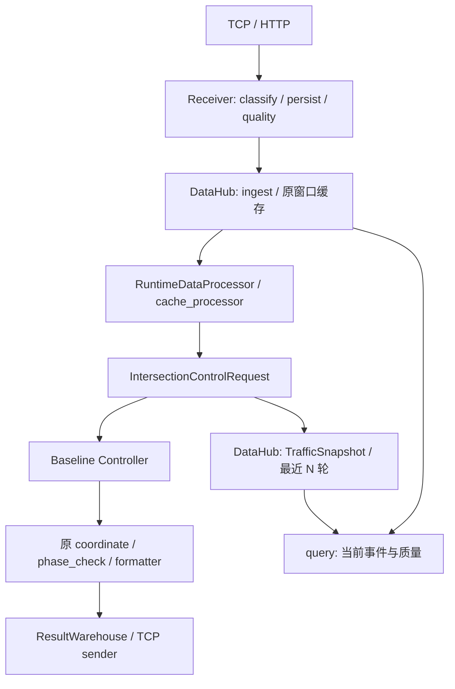

# AITC V2 Phase 3：内存 Traffic DataHub

实施基线：`4304612`，Phase 2 经 PR #39 合入 main。开始前重新 fetch 并核对
HEAD 与 origin/main；修改前主测试 170 项全部通过。契约见
[Phase 1](v2_contracts.md)，控制与黄金回放见 [Phase 2](v2_baseline_controller.md)。

## 职责和接线

`infra/data/datahub.py::TrafficDataHub` 是运行交通状态入口，使用 dict/deque，
复用 `ShortTermMemory` 的原时间窗口和原聚合函数。没有新增存储服务或抽象仓库层。



`create_application()` 构造一个 DataHub，并将同一实例注入 Receiver、Processor、
MemoryQueryLayer 和 PeriodicDecisionPipeline，应用通过 `app.datahub` 暴露它。
这些组件显式传入的 cache 必须是 DataHub 的同一缓存，否则启动时报错。
预测服务、静态配置和结果仓库仍保留原职责；DataHub 管理交通输入和决策输入历史。
既有 MemoryQueryLayer 接口保持兼容，新增查询通过其 `datahub` 属性访问。

生产接入仍先分类、记录质量、写兼容日志与长期历史，再调用 DataHub 更新状态。
旧接收器的缓存准入、溢出告警和雷达事件更新逻辑移入 DataHub；未改写聚合公式，
也没有按新质量提示过滤旧报文。

## 接口

| 方法 | 语义 |
|---|---|
| `ingest(RawTrafficEvent)` | 严格验证信封和报文分类一致性，完成复制与关联后，再更新兼容缓存及路口事件索引 |
| `ingest_classified(ClassifiedData)` | Receiver 的兼容入口，保留旧准入规则、原报文引用和缓存接收时钟 |
| `capture(IntersectionControlRequest)` | 复制、严格验证并保存实际送入单路口选择器的输入 |
| `latest(intersection_id)` | 最新已验证的 TrafficSnapshot，尚无状态时返回 None |
| `history(intersection_id, limit=None)` | 最近 N 轮，按最旧到最新排列，包含当前轮；limit=0 返回空列表 |
| `query(intersection_id, source=None, transport=None, kind=None)` | 当前原始事件、完整最新 snapshot、缺失字段、质量问题及截断标记 |

Phase 4 新增可选 include_snapshot=False，供只提取当前事件的专家省略完整控制
上下文复制；默认查询行为保持一致。专家字段与可用度见
[Phase 4 交通专家](v2_traffic_experts.md)。

所有 V2 查询和 snapshot 输入输出均深拷贝；修改结果不会影响内部历史、其他路口或
原控制输入。索引和历史使用 RLock，调用旧缓存及聚合算法时不持有这个锁。
查询不会调用模型、选择器或发送结果。

```python
from infra.data.classifier import DataSource

hub = app.datahub
state = hub.latest("1300068")
recent_rounds = hub.history("1300068", limit=5)
video = hub.query("1300068", source="video")
radar = hub.query("1300068", source="radar", transport=DataSource.HTTP)
unassociated = hub.query(None)
```

`latest` 表示最近一轮的实际算法输入，不会在每个报文到达时重新执行算法；
`query.events` 表示当前接收窗口。snapshot 的 current_time 是构建决策输入的时间，
事件 received_at 是接收时间，原报文 ts/start_time/time 保留原值、单位和类型。
轮次由 capture 的调用顺序确定，不按报文时间重新排序。

严格 ingest 要求 received_at 不晚于服务当前时钟，并且同一 kind 的接收时间不倒序，
不满足时在写入前报错。这样符合原 ShortTermMemory 的队首过期机制；此接口不承担
任意乱序或未来时间的离线回放。生产兼容入口仍使用原接收时钟，不增加时间过滤。

保存发生在选择器调用之前：选择器修改旧请求或随后失败，均不会污染已保存的输入。
这个历史记录输入，并不表示该轮控制成功。TrafficSnapshot 继承既有十五字段上下文，
其中 previous_coordinate 和预测映射仍保留算法需要的全局上下文，未裁成另一套业务状态。

若严格 snapshot 校验失败，DataHub 记录 `snapshot_validation_failed`，保留上一轮
已验证状态，query 标记 `snapshot_current_round` 缺失；原选择器继续执行原请求。
另外，普通 JSON 可解析但超过 Python 深复制递归深度的 vendor 报文，只在新增观察
路径记录 `event_capture_failed` 或 `snapshot_capture_failed`，旧缓存/选择器继续执行；
事件复制失败标记随原类别窗口过期。只捕获已知的 ValidationError/RecursionError，
其他异常仍按原错误路径记录。
因此严格契约是新观察接口的边界，并非旧控制输入的新增准入门禁。

## 路口关联与来源

预处理只建立索引和质量信息，不转换原 payload 数值、时间或结构。

- 显式信封 intersection_id 优先；否则取 Cross_id/CrossId/cross_id/intersection_id。
  统一经过已有 `aibi_to_xinkongji` 别名映射。显式关联可以覆盖报文自动关联，调用方
  应提供正确的信控路口 ID；原 payload 和旧聚合归属不随索引覆盖而改变。
- 视频检测器与溢出告警使用 `location_to_intersection_lambda`。
- 雷达及雷达事件通过 deviceNo → device_to_location；博研通过
  deviceId → boyan_device_to_location。
- 互联网 rid 反向查询 intersection_to_rid_lambda，保留所有关联路口，包括方向为
  None 的行；同一事件在多个路口查询中出现，但不会重复写入旧缓存。
- latest.inter_id 常为地图节点，只有匹配现有 intersection_list 才视为信控路口。
  无可靠关联的事件保留在 None 分区，标记 `intersection_unresolved`。
- 配置 intersection_list 时，未知 ID 统一进入 None 分区；未知请求只记录未关联质量，
  不分配快照历史。生产分区数受真实路口集合限制；未配置映射的独立实例允许调用方
  定义自己的路口 ID。
- 长期历史的旧 intersection_id 解析规则保持原样。本次改进的是 DataHub 查询索引，
  没有重写既有历史文件或假定两者关联字段完全相同。

`RawTrafficEvent.source` 是接入方式（tcp/http/unknown）；query 的 source 是领域来源：

| source | 现有原始数据类别 |
|---|---|
| video | flow、queue、stage、extend、overflow_warning |
| radar | radar、radar_event、boyan |
| internet | online、latest |
| ev | 当前无已接线原始类别，返回明确缺失 |

来源筛选只作用于 events。query.snapshot 始终是完整的最近决策上下文，不能把它
称为某个来源独立产生的 observation；尤其互联网协调依赖全局路段状态，不能在
本阶段声称已经完成单点 Internet Expert。EV 同样没有伪造业务状态或 confidence。
Expert 提取属于 Phase 4。

## 缺失、质量与容量

query 返回严格 `TrafficDataView`，包含 events、snapshot、missing_fields、
quality_issues 和 truncated。无事件/快照时明确列出 events/snapshot；video 检查
flow/queue 是否存在，radar 检查 radar 或 boyan 观测，internet 检查 online，EV 标记 ev。
原始契约缺失字段用 `kind.field` 表示，原契约质量文案原样保留。这里的存在性检查
不判断道路覆盖率、观测一致性或交通安全，也没有把默认零流量描述为真实观测。

每路口原始事件 deque 默认最多 2048 条。时间保留沿用原缓存类别窗口：queue 240s，
flow/stage/extend/radar/boyan 600s，online/latest 1800s；其余类别的查询保留为 600s。
query 和容量达到上限时清理当前分区，接入/查询每 30s 惰性扫描全部分区，周期决策
每轮强制清理并删除空分区；不启动清理后台线程。窗口边界使用 `age <= window`。查询按接收时间
判断过期，原持久告警/雷达事件状态表不因查询过期被清空。

容量截断只影响 V2 事件查询，不截断原算法缓存。仍处于有效时间窗口内的事件被容量
淘汰时，返回 truncated=true 和 `event_window_truncated`；淘汰记录全部过期后解除标记。
快照历史按轮数保留，不跟随原始事件 TTL 清空。运行状态只在进程内，重启后为空。

## 配置

本阶段在 `app/config.py` 引入 `TrafficMemorySettings(BaseSettings)`，并嵌入
RuntimeSettings.traffic_memory；只有配置模块读取环境。requirements.txt 与 CI 共用
新增的 pydantic-settings 依赖。原 RuntimeSettings 的其他字段和 .env 加载优先级
暂时保留，配置体系的后续收敛不在本阶段机械重写。

```dotenv
AITC_MEMORY_WINDOW=20
AITC_DATAHUB_EVENT_LIMIT=2048
```

N 可使用 MEMORY_WINDOW 别名，AITC_MEMORY_WINDOW 优先，两者都未配置则为 20。
参数必须为正整数，非法环境配置在装配时失败。显式构造同样受支持：

```python
from app.config import RuntimeSettings, TrafficMemorySettings

settings = RuntimeSettings(
    traffic_memory=TrafficMemorySettings(memory_window=5, datahub_event_limit=1024),
)
```

## 验证

新增测试覆盖严格接入、旧报文不被质量过滤、路口/来源隔离、嵌套数据复制、N 轮容量、
limit、TTL 边界、截断标记、设备/别名/多路口路段关联、未知数据和并发查询；
集成测试验证单实例装配、配置注入、选择器前保存与校验失败的旧链路继续执行。

启用 DataHub.capture 的两轮真实 186 路口回放与 Phase 2 原黄金 fixture 比较，
不重新生成期望值；验证选择器、全局协调、相位检查、最终 payload、TCP 换行字节及
绿波/互联网跨轮状态。它仍是固定工作日早高峰的合成输入回放，不代表实地性能验收。

```bash
.venv/bin/python -m compileall -q infra runtime agent app test
.venv/bin/python -m unittest discover -s test -p 'test_*.py'
.venv/bin/python -m unittest discover -s lib/control_functions/tests -p 'test_*.py'
.venv/bin/python -m unittest discover -s lib/control_functions/global_processors/tests -p 'test_*.py'
.venv/bin/python -m unittest discover -s lib/data_ANS/tests -p 'test_*.py'
```

经验模块 111 项仍存在原来的 2 failures 和 1 error：两项旧测试假设 1300086 不在
当前 pilot 白名单；另一项引用已移除的 Write_to_file。沿用基线审计记录，
没有修改业务白名单或恢复旧入口掩盖失败。

2026-10-03 最终验证：主测试从 170 项增至 210 项，全部通过（新增 DataHub 单元
29 项、集成 11 项）；控制函数 9 项、全局处理器 23 项全部通过；经验模块仍为上述
原 2 failures / 1 error。compileall、git diff --check 和依赖一致性检查通过。
