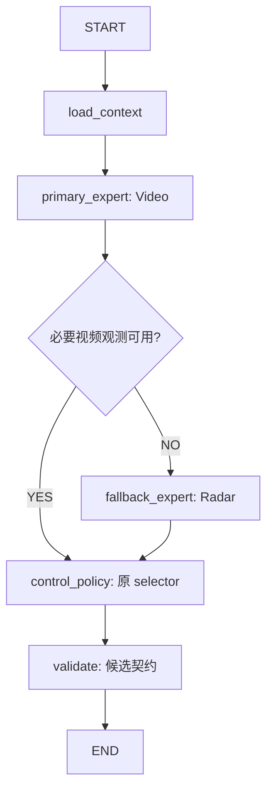

# AITC V2 Phase 5：最小 LangGraph Harness

实施基线：`8be8047`，Phase 4 经 PR #41 合入 main。修改前主测试 245 项通过。
本阶段接入真实 LangGraph，不在节点中实现交通算法；接口继续复用
[交通契约](v2_contracts.md)、[Baseline Controller](v2_baseline_controller.md)、
[DataHub](v2_datahub.md) 和 [来源专家](v2_traffic_experts.md)。

## 当前控制链

`create_application()` 创建 `agent.graph.ControlGraph`，与周期管线共享同一个
DataHub、Video/Radar 专家和 BaselineController。`app.decision_graph` 与
`app.decision_pipeline.decision_graph` 是同一实例。原 HTTP `AgentHarness` 继续
负责意图协议；周期控制使用新图，不重写原 HTTP 接口。



一轮处理仍先由原 RuntimeDataProcessor 聚合输入、读取预测和上一轮协调，随后
DataHub.capture 尝试保存本轮严格快照。`load_context` 加载这个完整原请求及可用的
本轮快照，不重新读取可能过时的历史输入。专家独立从 DataHub 读取当前来源事件。
快照 capture 因旧预测值为 None 失败时，质量描述照常保留，原请求继续进入控制。

Video 的 confidence=1、flow_map 与 queue_map 非空且未标记这两个必要字段缺失时，
直接调用控制策略。stage/extend/短窗等可选缺失不触发 Radar；必要观测缺失或
confidence<1 时才提取 Radar。Internet/EV 的明确 TODO 保留，本图不调用它们。

Radar 的原始观测没有视频流量和排队的业务定义，图不把它变成虚构视频特征。
两个专家仅提供路由证据，selector 始终收到原完整 IntersectionControlRequest。
即使两种来源都没有观测，仍执行原有规则、经验、时刻表等可靠控制路径。

## 状态、重试和异常

图使用实际 StateGraph、条件边、RetryPolicy 与 Runtime context。内部状态为
TypedDict，context 和返回的 ControlDecision 为普通 dataclass；专家输出和严格
候选继续在模块边界使用 Pydantic。每次调用有自己的状态，不保存共享 last result。

只有 primary_expert/fallback_expert 只读节点对 TimeoutError、ConnectionError
最多尝试两次，间隔 0.01s，关闭 jitter。重试耗尽后，由 LangGraph 原生
error_handler + Command 转读 Radar 或继续 Baseline。Pydantic ValidationError
和明确的 ExpertContractError 不重试，报告质量问题后降级。

未知 RuntimeError、KeyError、原生 ValueError/TypeError 等编程错误继续传播。
图不重试 selector，也不重试外部协调、经验写入和业务校验。生产外层保留原管线
的单路口异常日志及默认结果行为；读取故障的诊断随本轮 decision 返回，配置 logger
时同时记录原异常栈。

## 候选校验与输出顺序

```python
# 生产兼容入口：保留四元组与其中所有对象引用。
decision = app.decision_graph.execute_legacy(request, snapshot=snapshot)
plan, coordinate_map, model_info, experience = decision.selection
print(decision.route, decision.used_fallback, decision.quality_issues)

# 新严格入口：TrafficSnapshot -> 单路口候选 SignalPlan。
candidate = app.decision_graph.predict(snapshot)
```

`predict` 严格验证输入和候选，非法候选报错；`execute_legacy` 在候选不符合
SignalPlan 契约时返回 candidate=None 和 candidate_contract 问题，保留原四元组。
这防止把全局协调前的旧候选提前拒绝、截断、转换或夹限。

原生产顺序保持：

```text
本轮聚合/预测 -> capture -> Graph -> 原 selector 四元组
-> write_experience -> 更新单点结果/coordinate
-> 全局 coordinate（原四位置参数）
-> phase_check -> write_phase_check -> format_result -> 整批替换仓库/原推送接口
```

selector 返回的 coordinate 在经验写入前解包，因此经验写入失败时仍保留该坐标，
单点结果保持原默认值。动态替换 pipeline.dqn_select/coordinate 仍然有效。
最终 phase_check 继续在全局协调后执行一次，保留 reserved index 8 夹限、遇首个
零停止和缺配置只报告的旧行为。这里的 validate 是候选契约检查；完整确定性
Safety Gate 按原计划在 Phase 8 实施。

## 无 LLM 运行

开关集中在 app/config.py，AITC_LLM_ENABLED 优先于 LLM_ENABLED，接受既有布尔
文本规则。默认 True 保留原部署行为；显式 False 完全不创建模型客户端及三个
Qwen/控制 LLM 代理，也不执行启动时 list_models 健康检查。关闭时 llm_required
不再要求模型可达，未使用模型参数的范围校验跳过；环境值的语法错误仍会报错。

```bash
.venv/bin/python -m pip install -r requirements.txt
AITC_LLM_ENABLED=false .venv/bin/python Server_AITC.py
```

也可在原 .env 设置 `AITC_LLM_ENABLED=false`。如果使用 `LLM_ENABLED=false`，
需确认 .env/进程环境没有更高优先级的 AITC_LLM_ENABLED=true。
符号查询、确定性工具和绿波服务继续可用；显式请求未配置的 LLM 意图仍返回
原接口的配置错误。无 LLM 图可照常产出方案，不访问模型服务。

Phase 6 再建立统一 Model Gateway 和 provider 配置；本阶段没有新增模型调用。
配置仍采用现有 RuntimeSettings 加载规则与 pydantic-settings DataHub 配置，
不在图或专家中散布环境变量读取。

## 随机数兼容与依赖升级

真实回放发现 LangGraph 即使没有持久化 saver，也每步生成内部 checkpoint UUIDv6。
langgraph-checkpoint 默认 UUID 随机数会消耗 Python 全局 random，改变原配时随机
扰动和 TCP 诊断值，因而不能直接按默认行为接线。

agent/_langgraph_compat.py 在构图时只将 checkpoint ID 模块的随机源引用绑定到
独立 SystemRandom；不修改标准 random，也不保存/恢复调用级全局随机状态。
后者会回滚 selector 的合法随机消费，并破坏并发请求。重试 jitter 同时关闭。

该兼容点依赖内部实现，requirements 锁定已验证的 langgraph==1.2.12 与
langgraph-checkpoint==4.2.0。升级须重新审查 UUID 随机源，并通过全局 RNG、
合法 selector 随机消费、并发隔离和两轮完整黄金回放。原生节点错误处理所需版本
见 [LangGraph 官方故障处理文档](https://docs.langchain.com/oss/python/langgraph/fault-tolerance)。

## 验证范围

图单测覆盖两条分支、可选字段、低信心、严格输入与候选、完整原请求和四元组引用、
None 预测、已知故障重试/回退、未知故障与 selector 异常传播、随机数兼容，以及
共享图 32 路并发和前一轮状态不串。

集成使用真实 create_application，验证无 LLM 对象构造、启动健康检查、符号查询、
动态图回调、capture 顺序、经验写入失败坐标、协调异常仓库行为及协调后校验。
实际 186 路口无观测周期比较开图/关图全部 payload；另有两轮 372 次真实图调用，
完整回放对象、阶段检查点和 186 条每轮 TCP 帧摘要继续匹配未修改的黄金 fixture。

本机串行 186 路口无观测临时计时：关闭图约 0.50s，启用约 0.76s，两者输出相同。
这是开发环境的单次合成输入结果，不是实地负载验收；专家仍复用会复制全局模板的
旧聚合函数，现场完整事件窗口的吞吐量需另行实测。

```bash
.venv/bin/python -m compileall -q infra runtime agent app test
.venv/bin/python -m unittest discover -s test -p 'test_*.py'
.venv/bin/python -m unittest discover -s lib/control_functions/tests -p 'test_*.py'
.venv/bin/python -m unittest discover -s lib/control_functions/global_processors/tests -p 'test_*.py'
.venv/bin/python -m unittest discover -s lib/data_ANS/tests -p 'test_*.py'
```

经验模块既有的 2 failures / 1 error 继续按 [基线审计](v2_baseline_audit.md) 记录，
没有修改业务白名单或恢复已移除的 Write_to_file 来隐藏失败。

2026-10-03 最终验证：主测试从 245 项增至 288 项全部通过（新增图单元 29 项、
集成 14 项）；控制函数 9 项、全局处理器 23 项通过；经验模块 111 项仍为原
2 failures / 1 error。compileall、pip check 和 git diff --check 通过。
