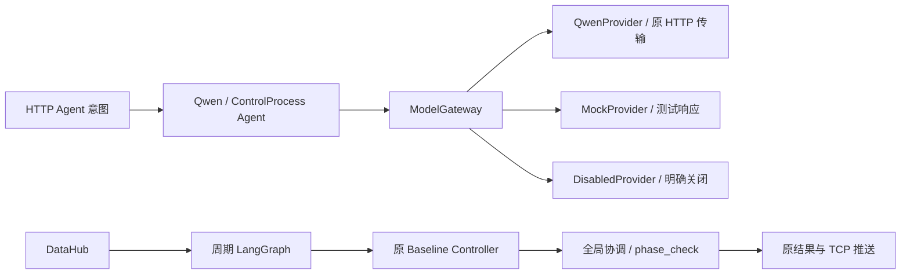

# AITC V2 Phase 6：统一 Model Gateway

实施基线：`d2f0efe`，Phase 5 经 PR #42 合入 main，修改前 288 项主测试通过。
本阶段将既有模型调用集中到 `app/infrastructure/llm/ModelGateway`，支持 Qwen、
Mock 和 Disabled 三种实际实现，并保留原 HTTP 意图接口和周期控制行为。

## 装配与调用

`create_application()` 暴露 `app.model_gateway`。启用 Qwen/Mock 时，两个 Qwen
Agent 和 ControlProcessAgent 共用这个实例，原 `app.llm_client` 属性指向同一
Gateway，保留 model/base_url/list_models 兼容接口。直接注入旧 chat client 的
Agent 构造仍可用，由 as_model_gateway 在入口包装；直接注入旧应用健康检查 client
也经过同一网关。



五处业务对话调用（两个 Agent 的路由与摘要、分步控制的解释）统一使用
invoke_sync。启动健康检查使用 check_ready，只有 QwenProvider 调用原 client 的
chat/list_models。模型响应没有加入周期图，Qwen 不可达或调用超时仍可独立配时。

```python
from app.infrastructure.llm import ModelRequest

request = ModelRequest(
    messages=[{"role": "user", "content": "描述当前交通状态"}],
    temperature=0.2, top_p=0.9, max_tokens=512,
)
response = await app.model_gateway.invoke(request)  # 异步调用者
response = app.model_gateway.invoke_sync(request)  # 现有同步 HTTP Agent
```

ModelRequest/ModelMessage/ModelResponse 使用严格 Pydantic 契约：文本、角色、采样
范围、正整数 token 数及非负重试数在调用前校验，不转换字符串数字或布尔数值。
输入在调度到 worker 前深复制，输出也深复制；共享实例不保存每轮 last result。

Qwen 继续使用原 `/chat/completions` 请求、鉴权、思考开关和默认 token 预算。
返回 JSON 在旧 str() 转换之前验证 choices 非空列表、message 对象和文本类型；
数值/列表/对象不能伪装成模型文本。content=null、空文本和省略 content 保留为
空字符串；reasoning_content 可选。原始 raw 完整保留，含 tool_calls，但本阶段
契约侧重文本对话，工具消息关联 ID 和结构化动作按 Phase 7 实施。

## Provider 和故障

| Provider | 调用与健康检查 |
|---|---|
| qwen | 原 OpenAI 兼容 HTTP client；健康检查验证 `/models` 的 data 列表与字符串 id |
| deepseek | 复用 OpenAI 兼容传输；使用远程 Bearer API key，并发送 DeepSeek 的 thinking 参数 |
| mock | 默认返回空模型文本；可注入有限 ModelResponse 脚本，线程安全逐个消费 |
| disabled | 调用抛 ModelDisabledError；装配时跳过模型客户端、三个模型 Agent 和健康检查 |

Mock 的默认空文本使现有 Agent 使用原有规则/摘要回退；它是测试模式，显式脚本
可复现工具选择和解释，并在耗尽时明确报错。测试响应不被当作真实传感器观测。
Mock 与 Disabled 都无需模型服务。

Gateway 区分 ModelDisabledError、ModelUnavailableError、ModelTimeoutError 和
ModelResponseError，保留 HTTP 状态码及原异常链。请求契约问题在 provider 调用
前直接报错，服务 JSON/UTF-8/响应结构错误映射为响应错误；未知编程异常继续传播。
`/models` 的 HTTP 200 空顶层、错误对象或畸形 data 不能被误判为就绪。
合法 data=[] 保留原服务检查含义；健康检查不保证配置的模型名称已经加载。

Gateway 不增加重试循环；Qwen 的网络、429 和原指定临时 5xx 重试仍由旧 transport
负责，默认最多三次请求。模型响应格式错误不重试。ControlProcessAgent 继续原来
每步两次解释尝试，叠加 transport 后单步最多六次请求；这条展示接口的历史行为
独立于周期控制。模型失败时原 Agent 的规则和摘要回退保持兼容。

invoke_sync 直接调用同一验证/provider 管线，会阻塞调用线程；异步调用者应使用
await invoke。异步接口通过 asyncio.to_thread 复用原同步传输，不阻塞事件循环。
取消会传播 CancelledError，但不能终止已开始的 urllib worker；它仍需完成或遇到
传输超时。当前超时是每次 socket 请求的 timeout，重试、排队和整个调用没有强制
总 deadline。没有通过 wait_for/asyncio.run 假装工作线程可以被取消，详见
[Python 线程运行文档](https://docs.python.org/3.11/library/asyncio-task.html#asyncio.to_thread)。

## 集中配置

app/config.py 的 ModelSettings 使用 pydantic-settings，成为模型字段的默认值和
环境别名来源。RuntimeSettings 保留旧 llm_* 构造字段和类默认值，由同一来源建立
model_settings；传齐已装配字段，环境变化不会覆盖显式配置。原 .env 加载仍不
覆盖已有进程变量，原空白环境值跳过规则保留。

| 字段 | 环境变量优先顺序 | 默认 |
|---|---|---|
| enabled | AITC_LLM_ENABLED → LLM_ENABLED | true |
| provider | AITC_MODEL_PROVIDER → MODEL_PROVIDER | qwen |
| name | AITC_MODEL_NAME → AITC_LLM_MODEL → MODEL_NAME → LLM_MODEL_ID | Qwen3-0.6B |
| base_url | AITC_MODEL_BASE_URL → AITC_LLM_BASE_URL → MODEL_BASE_URL → LLM_BASE_URL | http://127.0.0.1:8000/v1 |
| api_key | AITC_MODEL_API_KEY → AITC_LLM_API_KEY → MODEL_API_KEY → LLM_API_KEY | EMPTY |
| timeout_seconds | AITC_LLM_TIMEOUT_SECONDS → LLM_TIMEOUT_SECONDS | 60 |
| max_tokens | AITC_LLM_MAX_TOKENS → LLM_MAX_TOKENS | 1024 |
| enable_thinking | AITC_LLM_ENABLE_THINKING → LLM_ENABLE_THINKING | false |
| required | AITC_LLM_REQUIRED → LLM_REQUIRED | false |

enabled=false 优先于 provider；显式 provider=disabled 也关闭模型。未知 provider、
非法类型和非有限 timeout 在装配前失败。Qwen 启用时要求非空名称/URL及正 timeout/
token 预算；Mock/Disabled 可省略未使用的连接参数。API key 不出现在配置 repr
和验证错误文本，传输层接收原字符串。网络、目录、调度等其他配置保留原加载规则。

```bash
# 无模型服务
AITC_LLM_ENABLED=false .venv/bin/python Server_AITC.py

# Mock，不访问模型网络
AITC_LLM_ENABLED=true AITC_MODEL_PROVIDER=mock .venv/bin/python Server_AITC.py

# Qwen，服务不可达时默认告警后继续基础控制
AITC_LLM_ENABLED=true AITC_MODEL_PROVIDER=qwen .venv/bin/python Server_AITC.py
```

Qwen 模式只有显式 required=true 才在就绪检查失败时阻止启动，保留原部署选择。
LLM 环境变量优先规则可能使进程变量与 .env 中不同名字共同生效，应按表确定最终值。

## 验证

新增测试覆盖严格模型边界、真实 HTTP 请求形状与错误分类、原重试预算、畸形
就绪响应、Mock 脚本耗尽、深复制、共享并发、异步心跳/取消/排队快照、配置别名与
环境隔离。应用集成验证三个 provider、启动、五处 Agent 调用共用网关，并比较
Qwen 不可达、Mock、Disabled 的实际 186 路口完整输出；单独模型超时/失败也不
改变这条控制链。既有两轮控制阶段和 TCP 黄金回放继续使用未修改的 fixture。

```bash
.venv/bin/python -m compileall -q infra runtime agent app test
.venv/bin/python -m unittest discover -s test -p 'test_*.py'
.venv/bin/python -m unittest discover -s lib/control_functions/tests -p 'test_*.py'
.venv/bin/python -m unittest discover -s lib/control_functions/global_processors/tests -p 'test_*.py'
.venv/bin/python -m unittest discover -s lib/data_ANS/tests -p 'test_*.py'
```

本阶段初次验证时，经验模块既有 2 failures / 1 error 按 [基线审计](v2_baseline_audit.md) 记录。
模型语义动作和确定性 Safety Gate 分别按 Phase 7、Phase 8 继续实施。

2026-10-04 最终验证：主测试从 288 项增至 346 项全部通过（新增网关 36 项、
配置 14 项、应用集成 8 项）；控制函数 9 项、全局处理器 23 项通过；经验模块
111 项仍为原 2 failures / 1 error。compileall、pip check 和 git diff --check 通过。
模型 HTTP 协议由测试替身验证，本阶段未连接真实 Qwen 部署做推理验收。

2026-10-05 后续修复已消除经验模块三项既存问题，经验套件扩至 118 项全部通过。
原因、修复边界及当前阶段进度见 [当前架构总览](v2_current_architecture.md)。

Phase 7 已将共享 Gateway 接入可选周期 Planner/Reviewer，动作权限、独立开关与
请求级超时见 [受约束 Qwen Agent](v2_qwen_agent.md)。上文保留 Phase 6 当时的接线记录。

## DeepSeek API 适配（2026-10-10）

`provider=deepseek` 使用同一 `ModelGateway`、请求契约、Planner/Reviewer 和故障降级路径。
传输仍是 `/chat/completions` 与 `/models`；DeepSeek 模式不会发送 Qwen 专用的
`chat_template_kwargs`，而是在请求顶层发送 `thinking.type=enabled/disabled`。
当前受约束动作依赖最终 content 中的严格 JSON，因此建议保持 thinking=false。

```bash
AITC_LLM_ENABLED=true
AITC_MODEL_PROVIDER=deepseek
AITC_MODEL_NAME=deepseek-flash
AITC_MODEL_BASE_URL=https://api.deepseek.com
AITC_MODEL_API_KEY='仅保存在本机的 API key'
AITC_LLM_ENABLE_THINKING=false
AITC_CONTROL_AGENT_ENABLED=true
.venv/bin/python Server_AITC.py
```

DeepSeek 启用时必须显式配置 API key、模型名和 API 地址，防止误用本地 Qwen 默认值。
密钥由既有敏感配置字段隐藏，不应提交 `.env`。远程 API 超时、鉴权失败或不可达时，
周期控制继续执行原算法，后续路口在冷却窗口内跳过模型。
