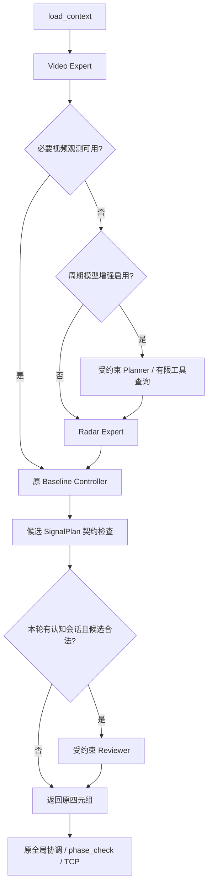

# AITC V2 Phase 7：受约束的 Qwen Planner / Reviewer

实施基线：`13caac3`，Phase 6 与经验回归修复经 PR #43 合入 main。
修改前主套件 349 项全部通过。本文描述周期控制的可选认知增强；既有 HTTP Agent
接口保留，双方共用 Phase 6 的 `ModelGateway`。

## 实际接线

`create_application()` 创建 `app.control_agent_tools`，仅在周期增强开关和模型都启用时
创建 `app.cognitive_agent`，并注入共享 `ControlGraph`。



正常视频快路径不调用模型。必要观测不足、confidence 不足或 Video 读取/契约失败时，
启用的认知层可以选择当前来源、历史与异常报告工具；随后仍执行确定性 Radar 路径
和原选择器。Planner 读到的已校验 Radar 结果在本轮复用，避免同轮重复提取。
模型失败、非法动作或预算耗尽不会代替原控制器的执行。

原完整算法请求继续保留预测、多源数据与上一轮协调输入。模型摘要不会覆盖这些输入，
selector 只运行一次；原四元组及对象引用、经验记录、全局协调顺序、最终 TCP ABI 保留。
候选契约不合法时仍走原兼容处理，不将其伪装成有效候选交给 Reviewer。

## 七类动作与权限

动作定义在 `agent/actions.py`，由 Pydantic discriminator 按 `tool` 校验。
模型只提交 content 中的一个完整 JSON 对象；不从 Markdown 或任意文本中猜测动作。
额外字段、未知工具、错误类型、越界 limit、模型指定路口或传入配时数值均被拒绝。
路口和本轮上下文由宿主绑定，模型不能修改算法输入或扩大调用预算。

| 工具 | 真实行为 |
|---|---|
| `query_traffic_state` | 当前路口来源事件计数、缺失/质量信息与本轮快照摘要；捕获失败时明确无本轮快照 |
| `query_history` | DataHub 保存的最近 1–20 轮，标明历史时间及是否为当前快照 |
| `query_video_state` | 已实现 Video Expert 的真实观测摘要，复用本轮已有结果 |
| `query_radar_state` | 已实现 Radar Expert 的真实观测摘要，复用本轮已有结果 |
| `run_control_policy` | Planner 请求进入原策略，由图节点执行一次；Reviewer 仅读取已计算的候选 |
| `review_signal_plan` | 提交严格审查意见，候选必须存在；只记录意见，不写入相位时间 |
| `report_anomaly` | 记录模型提出的异常解释，标记 reported_by=model、observation_verified=false |

Planner 不能提前调用 `review_signal_plan`。Reviewer 的意见只允许：
ACCEPT、WARN、REQUEST_MORE_DATA、SUGGEST_ADJUSTMENT、FALLBACK。
每项必须提供非空 reason（最多 1000 字符）。REQUEST_MORE_DATA 必须且只能附
video/radar 来源；SUGGEST_ADJUSTMENT 必须且只能附定性 suggestion；不接受可执行配时字段。

```json
{
  "tool": "review_signal_plan",
  "arguments": {
    "decision": "REQUEST_MORE_DATA",
    "source": "radar",
    "reason": "视频流量观测缺失，需要雷达证据"
  }
}
```

REQUEST_MORE_DATA 执行一次该来源查询并结束审查；已有本轮专家结果时复用，
不保证重新提取新观测，不再次运行算法或循环请求模型。
所有意见均为 advisory：ACCEPT 不是安全批准，WARN/SUGGEST_ADJUSTMENT 只记录建议，
FALLBACK 结束审查并保留原策略结果。本阶段没有开放替换、拒绝或直接修改最终方案的模型权限。
独立确定性 Safety Gate 按 Phase 8 实施。

Internet/EV Expert 仍是明确 TODO；`query_traffic_state` 可以读取 DataHub 已有的互联网
来源事件摘要，EV 缺失会明确报告，不生成虚构观测。

## 路口隔离与上下文

`ControlAgentTools` 重新校验快照、候选、专家和工具响应的路口/来源；每轮
`CognitiveSession` 独立保存模型调用数、工具观测、专家结果、审查、停止原因与错误。
共享 Controller 不保存 last decision，专家缓存不跨轮或跨路口使用。

原快照中的 predicted_flow、predicted_queue、previous_coordinate 是算法的全局映射。
送入模型的摘要只投影当前路口条目；全局映射非空但没有当前路口条目时标记 omitted_not_scoped，
原算法快照和历史内容不改变。工具与初始模型上下文使用同一摘要函数。

摘要对映射、向量、长字符串和深层数据作有界采样，明确标记省略，保留合法 JSON。
system prompt 与 user JSON 合计限制字符数；超限时重建明确省略的最小上下文，仍超限
则停止模型调用并继续原控制流程。非有限观测数字会标记省略；已知上下文/专家契约问题
记录 context_error/tool_error 并降级，未知程序错误继续传播。

观测和工具结果只进入 user JSON，提示词明确其内容不可信。执行权限由动作契约与工具
边界强制限制，不依赖模型遵守提示词来允许或禁止控制动作。

## 配置、预算与故障

`app/config.py` 的 `ControlAgentSettings` 使用 pydantic-settings，并通过
`RuntimeSettings.control_agent` 装配。显式对象不会被后续环境变化改写。

| 环境变量 | 默认 | 范围 / 含义 |
|---|---|---|
| `AITC_CONTROL_AGENT_ENABLED` | false | 周期认知层显式启用，独立于原 HTTP Agent |
| `AITC_CONTROL_AGENT_MAX_MODEL_CALLS` | 3 | 每路口每轮调用上限，可配置 1–6；实际可为 0，Planner 为 Reviewer 留一次预算 |
| `AITC_CONTROL_AGENT_TIMEOUT_SECONDS` | 2 | 每次模型 socket 请求 timeout，有限正数且不超过 30 |
| `AITC_CONTROL_AGENT_MAX_CONTEXT_CHARS` | 16000 | system+user 总字符，2000–100000 |
| `AITC_CONTROL_AGENT_FAILURE_COOLDOWN_SECONDS` | 30 | 模型服务故障后共享冷却，有限正数且不超过 3600 |

`AITC_LLM_ENABLED=false` 或 provider=disabled 优先关闭模型，周期增强开关不会绕过它。
默认周期增强关闭，保留原部署与快路径行为。

```bash
# 基础控制，不调用模型
AITC_LLM_ENABLED=false .venv/bin/python Server_AITC.py

# 显式开启周期 Qwen 增强；服务地址沿用 ModelSettings
AITC_LLM_ENABLED=true AITC_MODEL_PROVIDER=qwen \
AITC_CONTROL_AGENT_ENABLED=true .venv/bin/python Server_AITC.py

# Mock 不访问模型网络；默认空回复会明确降级，可注入有限脚本验收工具动作
AITC_LLM_ENABLED=true AITC_MODEL_PROVIDER=mock \
AITC_CONTROL_AGENT_ENABLED=true .venv/bin/python Server_AITC.py
```

周期认知请求统一经过共享 Gateway，固定 max_retries=0、max_tokens=512、temperature=0。
请求级 timeout 通过 Gateway/Provider 传给原 urllib 传输，不改变客户端默认 timeout，
原 HTTP Agent 的请求规则保持不变。模型服务超时/不可达触发线程安全的 monotonic 冷却；
冷却期间后续路口跳过模型，继续原控制。已经开始的并发调用仍需完成或遇到传输超时。

此预算约束调用次数与每次 socket timeout，不是整个决策的严格总 deadline。
上下文准备、工具执行、并发排队及传输过程仍耗时；本阶段没有宣称可强制中止运行中的线程。
启动时原 llm_required=true 的就绪要求保留，默认 false 则告警后继续基础控制。

## 查询结果与运行记录

`ControlGraph.execute_legacy(...).cognition` 返回本轮 CognitiveSession，包含审查和
工具证据；`selection` 仍为原四元组。周期管线沿用 selection，不增加 TCP 字段。
成功审查与模型异常报告通过现有 logger 记录单行 JSON，明确模型来源与 advisory 性质；
已知错误和降级也会记录。完整跨节点、候选到最终方案的决策 tracing 仍按 Phase 9 实施。

本轮沿现有 `agent/` 新增 actions、control_tools、cognitive、prompts 四个职责明确的
模块；没有为了参考目录机械迁移生产算法或建立第二套模型网关。

## 验证

新增单元与集成测试覆盖严格动作、真实来源/历史查询、无模型与正常快路径、有限调用
和上下文、非法 JSON/权限拒绝、模型故障与冷却恢复、错误观测身份、opaque 观测降级、
跨路口并发隔离、五种审查意见保留原候选、请求级 timeout，以及实际生产配时兼容。

开启认知层的两轮 186 路口回放继续匹配未修改的控制诊断与 TCP 黄金 fixture；
模型超时与不可达情况下的实际 186 路口输出与 Disabled 模式一致。

```bash
.venv/bin/python -m compileall -q infra runtime agent app test
.venv/bin/python -m unittest discover -s test -p 'test_*.py'
.venv/bin/python -m unittest discover -s lib/data_ANS/tests -p 'test_*.py'
.venv/bin/python -m unittest discover -s lib/control_functions/tests -p 'test_*.py'
.venv/bin/python -m unittest discover -s lib/control_functions/global_processors/tests -p 'test_*.py'
```

模型行为通过有限 Mock 脚本与传输测试替身验证，本阶段未连接真实 Qwen 部署做推理验收。

2026-10-06 最终验证：主套件从 349 项增至 **420 项全部通过**（新增 71 项：
工具/动作 22 项、认知层 32 项、控制配置 4 项、请求超时 2 项、图与应用集成 11 项）；
经验模块 118 项、控制函数 9 项、全局处理器 23 项全部通过。
compileall、pip check、git diff --check 通过。既有黄金 fixture 和配时算法未修改。
