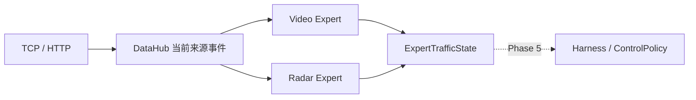

# AITC V2 Phase 4：交通数据专家

后续接线见 [Phase 5 LangGraph Harness](v2_langgraph_harness.md)；以下记录 Phase 4
的实现与当时验证，当前周期管线已通过图按条件读取 Video/Radar。

实施基线：`07014a4`，Phase 3 经 PR #40 合入 main。开始前重新 fetch 并核对
HEAD 与 origin/main；修改前主测试 210 项全部通过。数据接口见
[DataHub](v2_datahub.md)，统一输出见 [交通契约](v2_contracts.md)。

## 接口和接线

`agent/experts` 提供四个明确的专家入口，不新增基类、模型客户端或工具注册框架。

```python
from agent.experts import VideoExpert, RadarExpert, InternetExpert, EVExpert

video = VideoExpert(datahub, flow_duration_seconds=settings.flow_duration_seconds)
state = video.extract("1300068")   # ExpertTrafficState
radar_state = RadarExpert(datahub).extract("1300271")
```

所有专家声明 `extract(intersection_id) -> ExpertTrafficState`，统一使用 Phase 1 的
source、observation、missing_fields、confidence 四字段，未增加另一套交通状态。
Video/Radar 实际提取状态；Internet/EV 在校验 ID 后抛出明确的 NotImplementedError。

`create_application()` 将四个实例放入 `app.experts`，全部共享 `app.datahub`。

```python
video = app.experts["video"].extract("1300068")
radar = app.experts["radar"].extract("1300271")
print(video.missing_fields, video.confidence)
```

本阶段提供可调用的数据提取能力。周期管线继续使用原聚合与 Baseline Controller，
不调用这些专家；Phase 5 再实施 LangGraph 编排及条件路由。专家没有选方案、写结果
或推送的方法，提取过程不访问 LLM，不执行任何控制策略。



## 当前来源观测

专家从 `DataHub.query(..., source=..., include_snapshot=False).events` 取数据，
重新使用已有 cache_processor 聚合函数构建当前来源观测。DataHub 的最新控制输入
可能尚未产生，也可能落后于新报文；其中还包含所有来源、预测与协调上下文，
不能直接当作某个专家独立产生的 observation。

因此，初次接入而尚无 capture 时也可提取；新报文、过期和窗口截断立即反映在
下一次提取结果中。query 的新可选参数 include_snapshot=False 避免复制完整控制
上下文，只返回事件与质量；省略参数时保持 Phase 3 默认行为。参数必须为 bool，
主动省略快照时不报告 snapshot 缺失。

边界使用严格 TrafficDataView/TrafficSnapshot/ExpertTrafficState 校验，重新验证
已有模型实例；来源、路口或事件归属不一致时报错。输入报文的异构 payload 仍按
现有 adapter/聚合格式处理，未把数值字符串或毫秒时间机械转换成另一套格式。

| 专家 | 复用函数 | observation 字段 |
|---|---|---|
| Video | process_flow_data | traffic_vector、flow_map、traffic_vector_duration2 |
| Video | process_queue_data | queue_vector、queue_map |
| Video | process_stage_data、process_extend_data | stage_map、extend_map |
| Radar | process_radar_data、process_boyan_data | radar_map、boyan_map |

Video 保留 LRUD 流量顺序、七车道排队最大值及原时间桶。flow/queue/stage 的桶
使用原报文时间；extend/radar/boyan 的桶使用接收时间。短流量窗口沿用
settings.flow_duration_seconds，默认 150s，保持原 `age < duration` 边界。

Radar 保留 `radar_map[receive_second] = [payload]` 和
`boyan_map[direction][receive_second] = [payload]`。目前这些原函数只归档供应商
观测，不计算 Video 的流量和排队，Radar 不补造这些特征。

其余 TrafficSnapshot 字段保持空默认：预测和 previous_coordinate 留给后续执行
上下文加载，来源专家不复制旧控制输入的跨来源字段。未注册设备不会被强行关联；
显式信封覆盖路口 ID 时，实际聚合仍按原检测器/设备映射，错配无法产生该路口观测。

聚合只读取 DataHub 返回的复制数据和 Lambdas 模板，不改变旧缓存、捕获历史、共享
模板或原请求。返回对象的修改不会影响下一次提取。聚合仍复制旧全局模板，本阶段
未增加缓存；将来编排大量路口时需根据实际负载评估批量提取。

## 缺失与可用度

空的来源返回严格空 observation，并列出可用观测的缺失字段，confidence=0。
不把默认模板的零流量或零排队解释为真实观测。

- flow_map 必须有实际已计数记录，才提供 traffic_vector。
- queue_map 必须有实际有效车道时间桶，才提供 queue_vector；真实观测 queue=0
  仍然有效，car_nums=[] 或全无效车道不能证明已观测。
- lane 接受真实整数及旧协议的整数字符串；负索引、布尔值、浮点数和越界索引
  不生成对应观测组，并标记 flow.ycsb_cdbh 或 queue.car_nums.ycsb_cdbh。
- queue_map 中 queue/all 度量及 queue_vector 最大值同时检查：必须为精确
  int/float、有限且非负。后条报文覆盖时间桶不能掩盖向量里残留的无穷值或布尔值。
  无效时不输出该排队组；合法大整数不经 float 转换。
- stage_map、extend_map、traffic_vector_duration2 独立报告缺失。

confidence 定义为确定性的必要观测组可用度：

| 专家 | 必要观测 | 基础 confidence |
|---|---|---|
| Video | flow_map、queue_map | 两组均有 1；仅一组 0.5；均无 0 |
| Radar | radar_map 或 boyan_map 任一存在 | 有 1；均无 0 |

原事件存在契约质量问题、事件窗口被容量截断、复制缺失或流量计数不完整时，confidence
最多 0.5。可选 stage/extend/短窗缺失不影响 Video 的必要组覆盖度。需要路由时应
查看必要字段及 confidence，不能把任意可选缺失都当作必要观测不足。

Radar 的可用度只证明注册设备的原始观测 map 存在，不证明供应商 lane/speed
字段完整。整体可用度也未覆盖全路口车道覆盖率、所有供应商记录合法性、数据冲突
或实测传感器准确度；详细原报文质量仍通过 DataHub.query 查看。
stage/extend 继续使用旧转换与透传规则，未增加新的交通业务上下界。

## 溢出与未实现来源

Video warning 或 Radar event 存在时，专家标记 overflow_map 未提取，保留空字段。
原 process_overflow_events 合并多个来源、读取 datetime.now，并将共享
eventMap_Overflow_lambda 引用写入结果后修改它。本阶段不提前执行这个副作用，
旧周期链仍按原位置处理。样例雷达 createTime 的毫秒值与旧日期字符串解析规则
不一致，未通过修改格式或状态类型改变既有溢出行为。

InternetExpert 的 TODO 是明确全局路段协调数据如何进入单路口 observation；
EVExpert 的 TODO 是确认真实 EV/V2X 接入契约与设备映射。二者不能返回虚构观测、
成功置信度或配时方案，当前调用会得到可辨识的 NotImplementedError。

## 验证

新增单元测试覆盖当前事件与旧控制快照独立、真实聚合结构、空观测、真实零排队、
非法度量/车道、同桶覆盖后残留非法最大值、大整数、短窗/TTL 边界、路口与来源隔离、
质量和截断、深复制、严格 ID、溢出未提取及 Internet/EV 明确 TODO。

集成测试使用实际 create_application、协议接入和一次真实 186 路口周期控制，
验证专家即使不可用也不改变原周期链；空预测仓库产生的旧 None 仍由严格 capture
报告质量问题，原选择器继续工作，当前来源专家无需依赖这份控制快照。

另一项回归在 Phase 2 的两轮真实 186 路口 selector/coordinator 回放中读取当前
来源数据并调用专家，检查请求、缓存、共享模板、随机状态不变，完整结果和 TCP
字节摘要继续匹配未修改的黄金 fixture。专家结果没有替换回放请求；这验证只读提取
的兼容性，Phase 5 控制编排接线仍需独立验收。回放范围为固定工作日早高峰的合成
输入与真实仓库配置，不代表实地性能验收。

```bash
.venv/bin/python -m compileall -q infra runtime agent app test
.venv/bin/python -m unittest discover -s test -p 'test_*.py'
.venv/bin/python -m unittest discover -s lib/control_functions/tests -p 'test_*.py'
.venv/bin/python -m unittest discover -s lib/control_functions/global_processors/tests -p 'test_*.py'
.venv/bin/python -m unittest discover -s lib/data_ANS/tests -p 'test_*.py'
```

经验模块原有的 2 failures / 1 error 仍按 [基线审计](v2_baseline_audit.md) 记录：
两项测试对白名单中 1300086 的假设已过时，另一个测试引用已移除的 Write_to_file。
本阶段没有改变业务白名单或恢复旧入口。

2026-10-03 最终验证：主测试从 210 项增至 245 项全部通过（新增专家单元 27 项、
集成 8 项）；控制函数 9 项、全局处理器 23 项全部通过；经验模块 111 项仍为原
2 failures / 1 error。compileall 与 git diff --check 通过。
