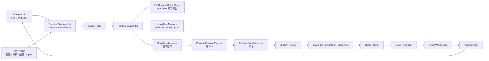

# AITC 源码阅读 + 微调路线（五天）

> 本轮定位：**以读代码为主**。代码只做三类微调——去冗余、简洁化、配置抽象。
> 不改算法行为、不改 TCP/HTTP 协议、不做架构大动。
>
> 权限前提：现在所有项目文件（含 `lib/`、根目录遗留模块）都可修改；
> 但「可改」不等于「该大改」，下面第 0 节的判据仍然成立。
>
> 五天是默认节奏，可按实际进度拉长到 7~8 天（每天的边界很清楚，随时可停）。

---

## 0. 这轮怎么做

### 0.1 允许的三类改动（以及反例）

| 类型 | 判据 | 典型动作 | 反例（不要做） |
| --- | --- | --- | --- |
| **去冗余** | 同一事实/默认值/逻辑出现在 ≥2 处，或某模块已无引用 | 删除死模块、合并重复默认值、去掉重复的样板方法 | 删除「看起来没人用」但实际被动态导入/外部脚本调用的模块 |
| **简洁化** | 一个函数/文件做的事太多，或同一段模板代码重复 ≥3 次 | 长函数拆成私有小函数、重复的响应/日志样板收敛 | 为「好看」重命名文件、改目录结构、改公开函数签名 |
| **配置抽象** | 路径、端口、阈值、目录名等**可变事实**写在代码里 | 收进 `app/config.py` 或新建路径模块，支持环境变量覆盖 | 把算法参数、业务常量也搬进配置（它们属于算法资产） |

判据之外的一切（分层调整、新抽象层、性能优化、行为变更）**本轮不做**，记进 backlog 即可。

### 0.2 每天的固定动作

```text
1) 读：按当天的阅读顺序表读代码（只抓「输入 → 输出 → 谁调用我」三件事）
2) 答：不看笔记回答当天自答题；答不出的回去补读
3) 改：只挑当天「微调候选清单」里列出的 1~3 条动手（改完立刻跑验证）
4) 证：compileall + 相关测试（必要时回放）全绿；不绿就回退，不带着问题进下一天
```

### 0.3 阅读方法（省一半时间）

1. **先追一条数据**：从 `flow.jsonl` 里的一条记录反着往回找，比顺序读源码快得多。
2. **用 grep 找调用者**：`git grep -n "函数名" -- "*.py"`；只被测试引用的多半是接口，不被任何人引用的才是死代码。
3. **拿测试当文档**：`test/test_*.py` 说明了每个模块的预期行为与边界，比读实现快。
4. **大文件只读入口**：`lib/DQN_Select.py`（1979 行）只读 `DQN_select()` 分发 + 任一路口函数的分支。
5. **时间盒**：单个模块 30 分钟读不完就跳过，先标记疑问，读完当天清单再回头。

### 0.4 笔记模板（每个模块一段，写进 `todo-done/learning/dayN-*.md`）

```markdown
### <模块名>（<文件>:<行数>）
- 输入：谁在什么时机调用我，传什么
- 输出：我返回/写入什么，写到哪里
- 副作用：线程、定时器、文件、网络、全局状态
- 疑问：不确定的点 + 用什么命令能验证
- 微调候选：现象 / 建议动作 / 风险
```

### 0.5 验证命令（每次改动后必跑）

```bash
.venv/bin/python -m compileall -q infra runtime agent app Lambdas.py
.venv/bin/python -m unittest discover -s test -p "test_*.py"     # 136 项，约 21 s
```

---

## 1. 全局地图（先建立，10 分钟）

### 1.1 目录 ↔ 职责 ↔ 规模

| 目录 / 文件 | 职责 | 主要模块（行数） |
| --- | --- | --- |
| `Server_AITC.py` | 启动入口：日志 + 信号 + `application.run()` | 33 |
| `runtime/` | 运行编排：装配、协议服务、周期决策、预测调度 | `http_server` 539、`decision_pipeline` 288、`application` 212、`tcp_server` 153、`result_formatter` 96、`prediction_scheduler` 68、`prediction_service` 63 |
| `infra/data/` | 数据底座：接收/分类/契约/缓存/仓库/聚合/输出/配置/同步/记忆 | `cache_processor` 352、`repository` 256、`receiver` 213、`config` 176、`memory/`（`manage` 116 + `short_term` 113 + `long_term` 107）、`classifier` 89、`schemas` 80、`prediction_repository` 80、`storage` 79、`runtime_processor` 77、`contracts` 55、`output_store` 53、`writer` 43、`ingest` 42、`cache` 41、`result_warehouse` 36、`result_sender` 35、`config_sync` 34、`quality` 33、`validation` 16 |
| `agent/` | Agent 层：注册中心、工具、Harness、Qwen 编排、MCP | `tools` 435、`harness` 345、`qwen_agent` 321、`mcp_server` 175、`registry` 138、`control_agent` 108 |
| `app/` | 配置 + 核心模型 + 工具 + LLM 客户端 | `config` 227、`core/tools/control_flow` 310、`core/tools/control_function_tools` 262、`infrastructure/llm/openai_compatible` 154、`core/tools/signal_timing` 96、`core/models/tool_response` 51、`core/control/` 系列 |
| `lib/` | 算法与配置资产（本轮可读、可微调，但不改算法行为） | `DQN_Select` 1979、`Global_intersection_coordinate` 1558、`green_wave_functions` 713、`road_state` 474、`AITC_tool` 338、`cha1` 304、`cha` 237、`config_api` 81，另 `control_functions/`、`data_ANS/`、`experience_pool/`、10 个 `*.json` |
| 根目录模块 | 算法入口、映射基座、遗留服务与离线脚本 | `Lambdas.py`（含内联配置大表）、`Flow_predict.py`、`Queue_predict.py`、`phase_check.py`、`time_schedule.py`（688，Flask 遗留）、`path_config.py`（62）、`config_check.py`（338）、`gen_online_config.py`（397）、`intersection_to_rid_lambda.py`（1128）、`new_online_data_map_lambda.py`（713）、`magic_hand.py`（4） |
| `web/index.html` | 单文件前端（3 个标签页） | 579 |
| `test/` | 单测 + 回放客户端 | 136 用例；`client_tcp` 677、`client_http` 259 |

### 1.2 端到端数据流



装配全部发生在 `runtime/application.py::create_application()`（**约 90 行的单一函数**，见微调候选 #1）。

### 1.3 推荐阅读顺序（依赖关系）

```text
Server_AITC.py
  └─ runtime/application.py（先只读装配顺序，不读细节）
       ├─ app/config.py                 ← 所有可调项的唯一来源
       ├─ runtime/tcp_server.py + http_server.py（协议与路由）
       ├─ infra/data/* （接收→分类→缓存→仓库→聚合→查询）
       │    └─ runtime/decision_pipeline.py（消费聚合结果）
       │         └─ lib/ 入口（DQN_select / coordinate / phase_check）
       └─ agent/*（harness → registry → tools → qwen_agent → mcp_server）
```

---

## 2. 五天阅读安排

### Day 1 — 入口、装配与协议层

**目标**：说清「服务怎么起来、几条线、每种请求进哪个函数」。

| 顺序 | 对象 | 规模 | 只抓这件事 | 读后能回答 |
| --- | --- | --- | --- | --- |
| 1 | `Server_AITC.py` | 33 | 日志、信号、停止路径 | 服务如何优雅退出？ |
| 2 | `runtime/application.py` | 212 | `create_application()` 的装配顺序 + `start()/stop()` 起了哪些线程 | 每个组件从哪来、依赖谁 |
| 3 | `app/config.py` | 227 | `RuntimeSettings` 字段、三种运行模式差异、`.env` 优先级 | 哪些行为可由环境变量改？ |
| 4 | `runtime/tcp_server.py` | 153 | 连接生命周期、`clients`、广播线程 | 上报与订阅为什么共用一个连接 |
| 5 | `runtime/http_server.py` | 539 | **只读路由表**（`do_GET`/`do_POST` 的 path 分派），实现细节跳过 | 有多少个对外接口、各自落到哪 |
| 6 | `runtime/prediction_scheduler.py` + `prediction_service.py` | 131 | 定时任务怎么起、预测结果给谁用 | 03:00 干了什么 |
| 7 | `web/index.html` | 579 | 三个标签页各调哪个接口 | 前端与后端接口对应关系 |

**自答**：① 一次 TCP 请求从进来到结果广播经过哪些函数？② 后台有哪些线程/定时器，怎么停？③ `replay` 模式与 `production` 差在哪三项？

**当天微调候选**：#1（装配函数拆分）、#2（配置默认值单一来源）、#3（默认参数硬编码 `logs_data`）。

---

### Day 2 — 数据底座 `infra/data`

**目标**：说清一条数据进来后的每一步，以及「窗口 / 仓库 / 输出」三者的分工。

| 顺序 | 对象 | 规模 | 只抓这件事 |
| --- | --- | --- | --- |
| 1 | `todo-done/data-contract.md` + `infra/data/contracts.py` | 24+55 | 11 类数据的来源/最小字段/时间与路口识别；为什么是非阻断校验 |
| 2 | `infra/data/classifier.py` + `schemas.py` + `ingest.py` | 89+80+42 | 分类优先级、`RuntimeRecord` 结构、统一接入门面 |
| 3 | `infra/data/receiver.py` | 213 | 接入后一口气做的 5 件事（分类/写库/写日志/窗口/特殊状态） |
| 4 | `infra/data/memory/short_term.py` | 113 | **窗口表**（flow 600 / queue 240 / …）与 `duration_data()` |
| 5 | `infra/data/memory/long_term.py` + `repository.py` + `storage.py` | 107+256+79 | JSONL 读写、按路口/时间查询、容量裁剪、原子写 |
| 6 | `infra/data/writer.py` + `output_store.py` | 43+53 | 写入门面与兼容输出（旧日志格式保留） |
| 7 | `infra/data/cache_processor.py` + `runtime_processor.py` | 352+77 | 每类数据如何聚合成**旧算法要的形态**；依赖注入方式 |
| 8 | `infra/data/memory/manage.py` + `result_warehouse.py` + `result_sender.py` | 116+36+35 | 统一查询语义（`status/summary/data/meta`）与「仓库 + 纯发送器」 |
| 9 | `infra/data/config.py` + `config_sync.py` + `quality.py` + `validation.py` | 176+34+33+16 | 配置资源枚举、写校验、Nacos 同步边界、质量统计 |

**自答**：① 新增一种数据类型要改哪几处？② 为什么溢出告警与雷达事件不进窗口？③ 窗口缓存与运行仓库分别被谁读？④ 换成 Redis 要动哪里？

**当天微调候选**：#4（配置路径硬编码）、#9（两套 JSON 存储实现，仅记录不合并）、#10（流动窗口默认值易误解）。

---

### Day 3 — 决策链路与算法边界

**目标**：说清 50 s 周期内每一步，以及每个 `lib` 入口的输入输出。

| 顺序 | 对象 | 规模 | 只抓这件事 |
| --- | --- | --- | --- |
| 1 | `runtime/decision_pipeline.py` | 288 | `run_once()` 五步；`_process_single_intersection` 传给 `DQN_select` 的 13 个参数 |
| 2 | `runtime/result_formatter.py` | 96 | 动作/流量向量/模型信息如何打包成下发协议 |
| 3 | `Flow_predict.py` + `Queue_predict.py` | — | 预测产物路径与「当前预测」读取入口 |
| 4 | `Lambdas.py` | — | 字典基座（检测器/车道/路口/方向）+ **内联配置大表**（如 2206 行的 `intersection_to_rid_lambda`） |
| 5 | `lib/DQN_Select.py` | 1979 | 只读 `DQN_select()` 分发 + 一个路口函数的返回结构 |
| 6 | `lib/Global_intersection_coordinate.py` | 1558 | 只读 `coordinate()` 主流程（相邻协调 / online / 溢出 / 浮动值） |
| 7 | `phase_check.py` + `intersection_result_config.json` | — | 相位时长上下限与校验报告 |
| 8 | `lib/control_functions/` | — | `generate_intersection_plan` / `get_timetable_plan` / `process_all_intersections` 三个稳定入口（Day 4 的工具体） |

**自答**：① 一轮决策的输入对象是什么、输出写到几处？② `EXP_list` 给谁用？③ 相位校验能拦什么、拦不住什么？④ 预测缺失时链路如何降级？

**当天微调候选**：#5（`_info/_warning/_error` 样板重复）、#1 的决策部分（窗口/时长参数集中）。

---

### Day 4 — Agent / Harness / 工具 / MCP

**目标**：说清「模型怎么选工具、怎么取上下文、失败怎么办」，并能现场演示。

| 顺序 | 对象 | 规模 | 只抓这件事 |
| --- | --- | --- | --- |
| 1 | `app/core/models/tool_response.py` | 51 | 统一响应结构与错误语义 |
| 2 | `agent/registry.py` | 138 | `ToolSpec` / `ToolRegistry` / `IntentRegistry` 的注册与调用契约 |
| 3 | `agent/tools.py` | 435 | 7 个查询工具的 schema 与 `summary/full` 两档详情 |
| 4 | `app/core/tools/control_function_tools.py` | 262 | 3 个控制工具：只给 `cross_id` 时如何自动补实时上下文 |
| 5 | `agent/harness.py` | 345 | `handle()` 三层路由、`_record_call()` 埋点、意图分组 |
| 6 | `agent/qwen_agent.py` | 321 | `QwenAgent`（分步思考）与 `QwenToolRouterAgent`（多工具路由）差异 |
| 7 | `agent/control_agent.py` | 108 | 「规则给结果、模型给思考」+ LLM 失败回退 |
| 8 | `app/infrastructure/llm/openai_compatible.py` | 154 | 超时、max_tokens、thinking、`llm_required` 的边界 |
| 9 | `agent/mcp_server.py` | 175 | 注册中心 → FastMCP 的动态转换与独立进程启动 |
| 10 | `test/test_agent_registry.py`、`test_agent_tools.py`、`test_symbolic_agent.py`、`test_mcp_server.py` | — | 用测试确认契约与边界 |

**动手演示**（30 分钟内完成）

```bash
curl -s -X POST localhost:8088/api/agent/tools -d '{"request_text":"查询 1234 路口最近 10 分钟流量"}'
curl -s localhost:8088/api/agent/calls
.venv/bin/python agent/mcp_server.py     # 或用 MCP 客户端连，验证 list_tools
```

**自答**：① 新增一个工具要改哪几处？② 怎么防越权写操作？③ LLM 不可用时各入口表现如何？④ `summary/full` 解决了什么问题？

**当天微调候选**：#5（`_error` 样板）、工具 schema 里的重复字段描述（如每个 map 参数的描述可抽公共片段）。

---

### Day 5 — 配置体系收口 + 遗留盘点 + 部署检查

**目标**：把「配置抽象」这条主线一次做完，并给根目录遗留模块定性。

| 顺序 | 动作 | 说明 |
| --- | --- | --- |
| 1 | 落地微调 #2 / #3 / #4 | 运行配置默认值单一来源、去掉硬编码路径与目录默认值 |
| 2 | 缓存窗口配置化 | 把 `application.py` 里硬编码的 600/240/1800 表移到 `RuntimeSettings`，消除与 `short_term.py` 默认表的重复 |
| 3 | 根目录遗留盘点 | 用 `git grep` 逐个判定下面 #6 / #7 / #8 三组模块的去留，写成结论表 |
| 4 | 收敛脚本目录 | 离线脚本（生成/校验/文档）移入 `tools/` 或 `scripts/`，根目录只留运行入口与算法模块 |
| 5 | 部署检查（不重做部署） | `.env` 生产项、`AITC_RUN_MODE=production`、`/health`、回放冒烟、日志轮转路径 |

**部署检查命令**

```bash
AITC_RUN_MODE=production .venv/bin/python Server_AITC.py   # 绑定 0.0.0.0，确认端口与日志
curl -s http://127.0.0.1:8088/health
.venv/bin/python test/client_http.py --help                # 冒烟前先看参数
```

---

## 3. 微调候选清单（实测，按建议顺序）

| # | 位置 | 现象（已在仓库中核实） | 建议动作 | 风险 |
| --- | --- | --- | --- | --- |
| 1 | `runtime/application.py`::`create_application` | 20+ 组件在单个函数内顺序装配（约 90 行）；缓存窗口在此硬编码，与 `infra/data/memory/short_term.py` 的默认表重复 | 拆成 `_build_data_layer` / `_build_decision_layer` / `_build_agent_layer` 三个私有函数；窗口改由 settings 提供 | 低（纯搬家） |
| 2 | `app/config.py` | 默认值在 dataclass 字段与 `from_environment()` 中各写一份（如 `65432`、`8088`、`logs_data`、LLM 默认地址） | 默认值只保留在字段上，`from_environment()` 引用字段默认 | 低 |
| 3 | `infra/data/output_store.py:16`、`infra/data/prediction_repository.py:15`、`runtime/decision_pipeline.py:42` | 默认参数里硬编码 `"logs_data"`、`"logs_data/control_snapshots"` | 默认值改 `None`，由装配层显式注入 settings | 低 |
| 4 | `app/core/control/synergy/green_wave_api_adapter.py:18`、`phase_check.py:14`、`time_schedule/get_sch_for_cross.py:5` | 配置文件路径硬编码：`lib/green_wave_corridors.json`、`intersection_result_config.json`、`lib/road_info.json` | 集中到统一路径模块，允许环境变量覆盖 | 中（lib 侧调用点需兼容） |
| 5 | 各模块 | `_info/_warning/_error` 三个样板方法在 8 个类中重复 | 抽一个日志辅助（mixin 或小函数） | 低 |
| 6 | 根目录 `intersection_to_rid_lambda.py`(1128)、`new_online_data_map_lambda.py`(713)、`magic_hand.py`(4) | `git grep` 未见任何引用；真实数据已内联在 `Lambdas.py:2206` | 确认无动态导入后删除，或移入 `legacy/` | 低（删前再确认一次） |
| 7 | 根目录 `config_check.py`(338)、`gen_online_config.py`(397)、`gen_api_docs.py` | 离线脚本与运行入口混放 | 移入 `tools/`（或 `scripts/`），根目录只留运行必需文件 | 低 |
| 8 | `path_config.py`(62) + 根目录 `time_schedule.py`(688) | 遗留路径配置 + Flask 服务；仅被旧 `time_schedule` 服务引用，其依赖未进 `requirements.txt` | 定性为遗留（移入 `legacy/` 或明确标注），路径职责并入统一路径模块 | 中（确认无外部调用者） |
| 9 | `lib/_local_json_store.py` vs `infra/data/storage.py::JsonFileStore` | 两套原子 JSON 读写实现（temp + `os.replace`） | **本轮不合并**，只在文档记录 | 高（跨 lib 边界，调用方多） |
| 10 | `app/core/tools/control_function_tools.py` | `DEFAULT_FLOW_DURATION_SECONDS = 300` 与运行配置 `AITC_FLOW_DURATION_SECONDS`（150）不一致；运行时虽会被注入覆盖，但默认值易误读 | 去掉默认值（必填）或注明「仅占位，实际由配置注入」 | 低 |

建议顺序：**#1 → #2 → #3 → #10 → #5**（纯局部、风险最低）→ **#4 → #6 → #7**（需确认引用）→ **#8**（需外部确认）→ **#9 不做**。

---

## 4. 配置抽象方案（本轮唯一的设计动作）

### 4.1 现状：配置散在五处

| 位置 | 内容 | 问题 |
| --- | --- | --- |
| `app/config.py` | 运行配置（端口、周期、目录、LLM、开关） | 默认值双份定义；窗口表不在这里 |
| 代码内默认参数 | `logs_data`、`logs_data/control_snapshots`、窗口秒数 | 与 `app/config.py` 重复，改一处漏一处 |
| 硬编码路径 | 绿波走廊、相位上下限、`road_info` 三个配置路径 | 无法用环境变量切换 |
| `lib/*.json`（10 个） | 算法资产 + 运维可调配置混放 | 分不清「哪些能改、谁能改」 |
| 根目录 `.py` 内联大表 | `Lambdas.py` 的映射表；两个已无引用的生成式数据模块 | 数据以代码形式存在，diff 噪声大 |

### 4.2 目标：三类配置、三个来源

```text
① 运行配置（可变、部署相关）→ app/config.py::RuntimeSettings（env / .env 覆盖）
     端口、周期、目录、LLM、后台任务开关、**缓存窗口**
② 资源路径（可变、部署相关）→ 统一路径模块（建议 app/paths.py，或并入 RuntimeSettings）
     运行数据目录、输出目录、预测目录、配置目录、控制快照目录
③ 静态数据（版本化、随代码发布）→ 现存的 JSON 文件，保持原位但分类标注
     算法资产：lib/*.json（road_info、cross_info、floating_value、road_state、绿波走廊…）
     业务配置：intersection_result_config.json（相位上下限，可热更）
```

### 4.3 落地步骤与验收

1. `RuntimeSettings` 增加缓存窗口字段（默认值 = 现 `short_term.py` 的表）；
2. `create_application()` 不再写字面量窗口，改读 settings；
3. 三个硬编码配置路径改为「settings 字段 + 环境变量兜底」；
4. 默认参数里的目录名去 `logs_data`，由装配层注入；
5. **验收**：`git grep -n "logs_data\|65432\|8088" -- "*.py"` 的结果只出现在 `app/config.py`（与测试/脚本），其余文件不再出现。

---

## 5. 验证与提交（DoD）

```text
1) .venv/bin/python -m compileall -q infra runtime agent app Lambdas.py   → 通过
2) .venv/bin/python -m unittest discover -s test -p "test_*.py"          → 136 项全绿
3) 与改动相关的一次回放（TCP 或 HTTP）                                              → 落盘与决策日志正常
4) 短分支（chore/ 或 refactor/）+ 中文约定式提交 + PR（Squash 合入、删源分支）
5) 每个微调一个提交，便于回退；一次 PR 不超过 3 个微调
```

提交信息示例：

```text
chore: 统一运行配置默认值来源，消除重复定义
refactor: 拆分配置装配函数，缓存窗口改由运行配置提供
chore: 集中配置文件路径，移除三处硬编码
```

---

## 6. 收尾与衔接

- **五天结束时应有**：每个模块的「输入 → 输出 → 调用方」笔记；微调清单 1~8 落地或明确结论；
  `git grep` 验证配置只出现在一处；全量测试 + 一次回放通过。
- **明确不做（记入 backlog）**：架构分层调整、控制模块拆分（`control-module-design.md` 第 3-7 步）、
  Agent 可观测性升级、评测体系、FastAPI 管理面、MCP 双向接入、存储替换（Redis）。
- **下一步再定**：等微调落地、对代码有了体感之后，再决定是从「配置与路径收口」
  继续走向「部署化」，还是从「Agent 可观测性」切入功能重构。
