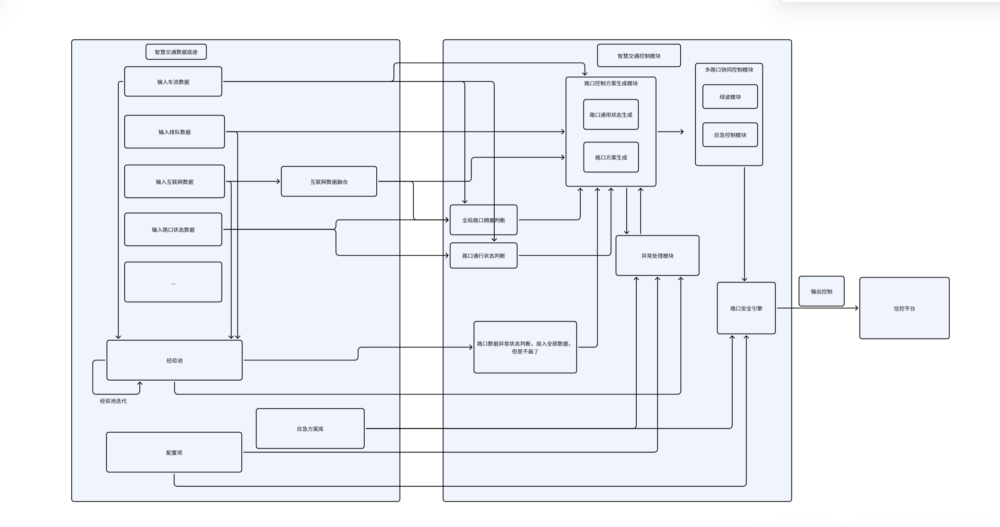

# AITC

从9月24日，我开始学习这个项目，这个项目本身是一个一年的祖传项目，由子扬师兄和一丹师兄进行构建，后由呼庄严，王文兴，杜雨霏经手，项目本身完全屎山，我将利用这几天假期对其进行理解重构，将其修改至足以作为一个优秀的项目写到我的简历上。

## OverAll

项目的一个非常简单的逻辑是：持续收 + 周期推

`客户端`发送186个路口的`各种数据`给服务端

`服务端`处理后发送控制信号给客户端

各种数据：检测器级原始数据（按检测器/设备编号），服务端映射聚合到 186 路口

客户端：
信控平台（TCP 65432）流量/排队/阶段/互联网数据，并接收广播
和 
雷达/博研（HTTP 8088）雷达数据、雷达事件、博研数据，前端/Agent 调用也是走http8088

服务端：我们，发回的是相位时长方案，由平台执行到信号灯。广播走的是 TCP 的 clients 名单，只给信控平台

服务端包括 连接层、决策层、广播层，三线并行
连接层：数据持续流入（不中断），这层会查错包括格式错、字段错
决策层：决策线程某一时刻醒来跑一轮（耗时几秒，跑完补足剩余时间再睡）
广播层：广播线程按自己的 50 s 节拍发快照

## 优化记录

1、设计数据库

2、其实我认为有一些实现可以采用有更成熟的框架，但是我们采用自己的笨方法实现了，后面需要调整

